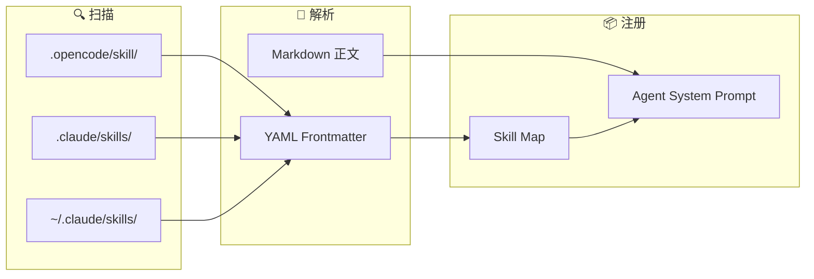

# 内部模块: Skill (技能系统)

> SKILL.md 指令模板的加载和管理。

## 1. 概览 (Overview)
- **路径**: `packages/opencode/src/skill/`
- **定位**: 加载可复用的指令模板，扩展 Agent 的专业能力。
- **兼容性**: 同时支持 OpenCode 和 Claude 格式

## 2. Skill 加载流程



## 3. 什么是 Skill？

Skill 是一组预定义的指令和知识，让 Agent 更专业地处理特定任务。

**示例: Python 专家 Skill**

```markdown
---
name: python-expert
description: Python 开发最佳实践
---

# Python Expert

## 代码规范
- 使用 type hints
- 遵循 PEP 8
- 使用 ruff 格式化

## 测试
- 使用 pytest 框架
- 覆盖率要求 > 80%
```

## 3. 目录扫描规则

Skill 系统会扫描以下位置：

### 3.1 OpenCode 格式

```
.opencode/
├── skill/
│   └── python/
│       └── SKILL.md     ✓ 匹配
│   └── SKILL.md         ✓ 匹配
└── skills/
    └── devops/
        └── SKILL.md     ✓ 匹配
```

Glob: `{skill,skills}/**/SKILL.md`

### 3.2 Claude 格式 (兼容)

```
.claude/
└── skills/
    └── code-review/
        └── SKILL.md     ✓ 匹配

# 全局 Skills
~/.claude/skills/
└── general/
    └── SKILL.md         ✓ 匹配
```

Glob: `skills/**/SKILL.md`

## 4. 核心代码解析

### 4.1 Skill 数据结构

```typescript
export const Info = z.object({
  name: z.string(),         // 技能名称 (必须唯一)
  description: z.string(),  // 描述
  location: z.string(),     // 文件路径
})
```

### 4.2 加载逻辑

```typescript
export const state = Instance.state(async () => {
  const skills: Record<string, Info> = {}

  const addSkill = async (match: string) => {
    // 解析 SKILL.md 的 YAML frontmatter
    const md = await ConfigMarkdown.parse(match)
    if (!md) return

    const parsed = Info.pick({ name: true, description: true }).safeParse(md.data)
    if (!parsed.success) return

    // 检查重复
    if (skills[parsed.data.name]) {
      log.warn("duplicate skill name", {
        name: parsed.data.name,
        existing: skills[parsed.data.name].location,
        duplicate: match,
      })
    }

    skills[parsed.data.name] = {
      name: parsed.data.name,
      description: parsed.data.description,
      location: match,
    }
  }

  // 1. 扫描 .claude/skills/ (项目级 + 全局)
  const claudeDirs = await Filesystem.up({
    targets: [".claude"],
    start: Instance.directory,
    stop: Instance.worktree,
  })
  
  // 添加全局 ~/.claude/skills/
  const globalClaude = `${Global.Path.home}/.claude`
  if (await exists(globalClaude)) {
    claudeDirs.push(globalClaude)
  }

  for (const dir of claudeDirs) {
    for await (const match of CLAUDE_SKILL_GLOB.scan({ cwd: dir })) {
      await addSkill(match)
    }
  }

  // 2. 扫描 .opencode/{skill,skills}/
  for (const dir of await Config.directories()) {
    for await (const match of OPENCODE_SKILL_GLOB.scan({ cwd: dir })) {
      await addSkill(match)
    }
  }

  return skills
})
```

### 4.3 API

```typescript
// 获取单个 Skill
export async function get(name: string) {
  return state().then((x) => x[name])
}

// 获取所有 Skills
export async function all() {
  return state().then((x) => Object.values(x))
}
```

## 5. 使用场景

### 场景 1: 在 Prompt 中引用 Skill

```
opencode> use skill: python-expert

opencode> 帮我重构这个函数
```

Agent 会加载 `python-expert` Skill 的内容作为 System Prompt 的一部分。

### 场景 2: Agent 配置

```yaml
# .opencode/agent.yaml
agents:
  - name: python-dev
    skills:
      - python-expert
      - code-review
```

## 6. 与 Claude Skills 的关系

OpenCode 的 Skill 系统设计上 **兼容 Claude** 格式：

| 特性 | OpenCode | Claude |
| :--- | :--- | :--- |
| **目录** | `.opencode/skill/` | `.claude/skills/` |
| **文件名** | `SKILL.md` | `SKILL.md` |
| **格式** | YAML frontmatter | YAML frontmatter |
| **全局位置** | 无 | `~/.claude/skills/` |

OpenCode 会同时扫描两种格式，实现无缝迁移。

## 7. SKILL.md 格式

```markdown
---
name: skill-name      # 必需, 唯一标识
description: 描述     # 必需, 显示给用户
---

# 标题

正文内容...
这里的内容会被注入到 System Prompt 中。
```

## 8. 错误处理

```typescript
export const InvalidError = NamedError.create(
  "SkillInvalidError",
  z.object({
    path: z.string(),
    message: z.string().optional(),
    issues: z.custom<z.core.$ZodIssue[]>().optional(),
  }),
)

export const NameMismatchError = NamedError.create(
  "SkillNameMismatchError",
  z.object({
    path: z.string(),
    expected: z.string(),
    actual: z.string(),
  }),
)
```

## 9. 总结

Skill 模块是 OpenCode **知识注入** 的机制：
- **声明式**: 通过 Markdown 文件定义
- **模块化**: 一个 Skill 一个文件
- **继承式**: 支持项目级和全局级
- **兼容性**: 支持 Claude 格式迁移
