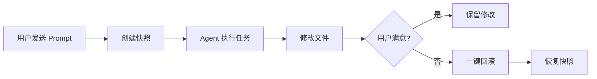

# 内部模块: Snapshot (快照系统)

> 基于 Git 的文件变更追踪和回滚机制。

## 1. 概览 (Overview)
- **路径**: `packages/opencode/src/snapshot/`
- **定位**: 追踪 Agent 对文件的修改，支持一键回滚。
- **核心技术**: Git (独立仓库)

## 2. 设计理念

Agent 可能会执行破坏性的文件操作。Snapshot 提供了 **"安全网"**：



## 3. 核心概念

### 3.1 独立 Git 仓库

Snapshot **不使用项目的 `.git`**，而是在用户数据目录创建独立的 Git 仓库：

```
~/.opencode/data/snapshot/{projectID}/.git
```

**优势**:
- 不污染项目的 Git 历史
- 不影响用户的版本控制工作流
- 支持非 Git 项目

### 3.2 核心操作

| 操作 | 函数 | 描述 |
| :--- | :--- | :--- |
| **追踪** | `track()` | 记录当前文件状态，返回 tree hash |
| **对比** | `patch()` | 获取两个快照之间的差异文件列表 |
| **差异** | `diff()` | 获取 unified diff 格式的变更 |
| **回滚** | `revert()` | 将指定文件恢复到快照状态 |

## 4. 核心代码解析

### 4.1 创建快照 (`track`)

```typescript
export async function track() {
  if (Instance.project.vcs !== "git") return  // 仅 Git 项目
  
  const cfg = await Config.get()
  if (cfg.snapshot === false) return  // 用户可禁用
  
  const git = gitdir()  // ~/.opencode/data/snapshot/{projectID}
  
  // 初始化独立 Git 仓库
  if (await fs.mkdir(git, { recursive: true })) {
    await $`git init`.env({
      GIT_DIR: git,
      GIT_WORK_TREE: Instance.worktree,
    })
  }
  
  // 暂存所有文件
  await $`git --git-dir ${git} --work-tree ${worktree} add .`
  
  // 生成 tree hash (不创建 commit)
  const hash = await $`git --git-dir ${git} --work-tree ${worktree} write-tree`.text()
  
  return hash.trim()  // 例如: "abc123..."
}
```

**注意**: 使用 `write-tree` 而非 `commit`：
- 更快 (不需要 author 信息)
- 更轻量 (不创建 commit 对象)
- 足以进行 diff 和 checkout

### 4.2 获取变更文件 (`patch`)

```typescript
export async function patch(hash: string): Promise<Patch> {
  const git = gitdir()
  
  // 暂存当前状态
  await $`git --git-dir ${git} --work-tree ${worktree} add .`
  
  // 比较 hash 和当前状态，获取变更文件列表
  const result = await $`git --git-dir ${git} --work-tree ${worktree} diff --name-only ${hash} -- .`.text()

  return {
    hash,
    files: result.split("\n").filter(Boolean).map(f => path.join(worktree, f)),
  }
}
```

### 4.3 回滚文件 (`revert`)

```typescript
export async function revert(patches: Patch[]) {
  const files = new Set<string>()
  const git = gitdir()
  
  for (const item of patches) {
    for (const file of item.files) {
      if (files.has(file)) continue
      
      // 恢复到快照版本
      const result = await $`git --git-dir ${git} --work-tree ${worktree} checkout ${item.hash} -- ${file}`
      
      if (result.exitCode !== 0) {
        // 检查文件是否存在于快照中
        const checkTree = await $`git ls-tree ${item.hash} -- ${relativePath}`
        
        if (!checkTree.text().trim()) {
          // 文件不存在于快照 = 新创建的文件 → 删除它
          await fs.unlink(file)
        }
      }
      
      files.add(file)
    }
  }
}
```

### 4.4 完整 Diff (`diffFull`)

```typescript
export async function diffFull(from: string, to: string): Promise<FileDiff[]> {
  const result: FileDiff[] = []
  
  // 获取变更统计
  for (const line of await $`git diff --numstat ${from} ${to}`.lines()) {
    const [additions, deletions, file] = line.split("\t")
    
    // 获取文件内容
    const before = await $`git show ${from}:${file}`.text()
    const after = await $`git show ${to}:${file}`.text()
    
    result.push({
      file,
      before,
      after,
      additions: parseInt(additions),
      deletions: parseInt(deletions),
    })
  }
  
  return result
}
```

## 5. 使用场景

### 场景 1: Agent 修改了多个文件，用户不满意

```typescript
// 1. 任务开始前创建快照
const before = await Snapshot.track()

// 2. Agent 执行修改...

// 3. 用户点击 "Revert All"
const changes = await Snapshot.patch(before)
await Snapshot.revert([changes])

// 所有文件恢复原状
```

### 场景 2: 增量回滚

```typescript
// 只回滚特定文件
await Snapshot.revert([{
  hash: beforeHash,
  files: ["/path/to/specific/file.ts"]
}])
```

## 6. 与 Worktree 的关系

| 特性 | Snapshot | Worktree |
| :--- | :--- | :--- |
| **目的** | 追踪变更，支持回滚 | 隔离实验环境 |
| **范围** | 单个文件级别 | 整个工作区 |
| **持久性** | 会话内有效 | 可跨会话保留 |
| **用户操作** | "Undo" 按钮 | 创建/删除/合并分支 |

它们经常配合使用：在 Worktree 中工作时，Snapshot 仍然会追踪变更。

## 7. 配置

```json
// opencode.json
{
  "snapshot": false  // 禁用快照 (默认 true)
}
```

禁用场景：
- 大型二进制文件目录 (性能考虑)
- 用户偏好使用自己的版本控制

## 8. 总结

Snapshot 模块是 OpenCode **可逆操作** 的基础：
- **无侵入**: 使用独立 Git 仓库
- **轻量级**: 仅跟踪 tree，不创建 commit
- **精确控制**: 支持文件级别的回滚
- **用户友好**: 前端展示 diff，一键撤销
