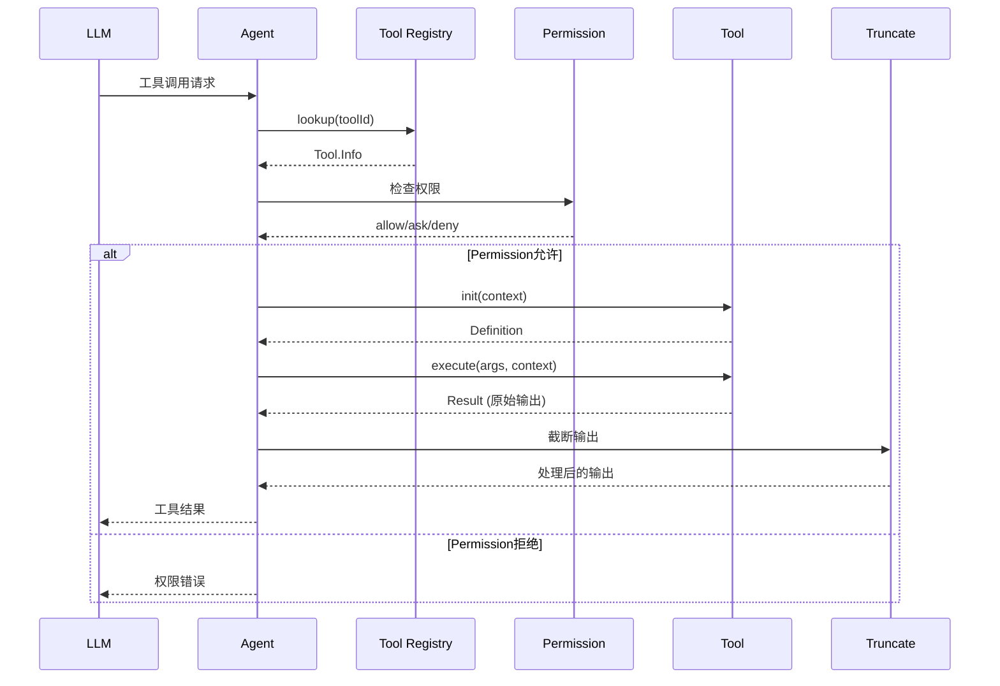

# 内部模块: Tool (工具系统)

> OpenCode 的工具注册、发现和执行机制。

---

## 1. 概览 (Overview)

- **路径**: `packages/opencode/src/tool/`
- **定位**: Agent 的"手脚"，所有可执行能力的定义和管理
- **核心职责**: 
  - 工具的注册和发现
  - 工具的执行和结果处理
  - 工具输出的截断和格式化

---

## 2. 工具分类

### 2.1 内置工具 (Built-in Tools)

基于 `src/tool/` 目录：

| 工具 | 文件 | 描述 | 优先级 |
|------|------|------|--------|
| **bash** | `bash.ts` | 执行 Shell 命令 | ⭐⭐⭐⭐⭐ |
| **read** | `read.ts` | 读取文件内容 | ⭐⭐⭐⭐⭐ |
| **write** | `write.ts` | 写入文件 | ⭐⭐⭐⭐⭐ |
| **edit** | `edit.ts` | 编辑文件（精确替换） | ⭐⭐⭐⭐⭐ |
| **glob** | `glob.ts` | 查找文件（模式匹配） | ⭐⭐⭐⭐ |
| **grep** | `grep.ts` | 搜索文件内容 | ⭐⭐⭐⭐ |
| **webfetch** | `webfetch.ts` | 获取网络资源 | ⭐⭐⭐⭐ |
| **websearch** | `websearch.ts` | 网络搜索 | ⭐⭐⭐ |
| **task** | `task.ts` | 委派子 Agent | ⭐⭐⭐⭐ |
| **todowrite** | `todo.ts` | 写入 TODO 列表 | ⭐⭐⭐ |
| **todoread** | `todo.ts` | 读取 TODO 列表 | ⭐⭐⭐ |
| **question** | `question.ts` | 询问用户 | ⭐⭐⭐ |
| **skill** | `skill.ts` | 加载 Skill 模板 | ⭐⭐⭐ |
| **lsp** | `lsp.ts` | LSP 代码智能 | ⭐⭐⭐⭐ |
| **multiedit** | `multiedit.ts` | 批量编辑 | ⭐⭐⭐ |
| **patch** | `patch.ts` | 应用补丁 | ⭐⭐ |
| **codesearch** | `codesearch.ts` | 代码搜索 | ⭐⭐⭐ |
| **batch** | `batch.ts` | 批处理 | ⭐⭐ |
| **ls** | `ls.ts` | 列出目录 | ⭐⭐ |

### 2.2 自定义工具 (Custom Tools)

来自两个来源：

1. **配置目录工具**
   - 位置: `.opencode/tool/*.ts`
   - 自动发现和加载

2. **插件工具**
   - 来源: Plugin 系统
   - 通过 `plugin.tool` 注册

### 2.3 MCP 工具 (MCP Tools)

- 来源: MCP Server
- 动态发现
- 运行时注册

---

## 3. 工具注册表 (Tool Registry)

### 3.1 核心实现

**位置**: `src/tool/registry.ts`

```typescript
export namespace ToolRegistry {
  // 状态管理
  export const state = Instance.state(async () => {
    const custom = [] as Tool.Info[]
    
    // 1. 扫描配置目录
    const glob = new Bun.Glob("tool/*.{js,ts}")
    for (const dir of await Config.directories()) {
      for await (const match of glob.scan({ cwd: dir })) {
        const mod = await import(match)
        // 注册工具...
      }
    }
    
    // 2. 加载插件工具
    const plugins = await Plugin.list()
    for (const plugin of plugins) {
      for (const [id, def] of Object.entries(plugin.tool ?? {})) {
        custom.push(fromPlugin(id, def))
      }
    }
    
    return { custom }
  })
  
  // 获取所有工具
  async function all(): Promise<Tool.Info[]> {
    const custom = await state().then(x => x.custom)
    return [
      InvalidTool,
      QuestionTool,
      BashTool,
      ReadTool,
      EditTool,
      // ... 所有内置工具
      ...custom  // 自定义工具
    ]
  }
  
  // 为特定 Agent 过滤工具
  export async function tools(
    agentId: string,
    providerID: string
  ): Promise<Tool.Info[]> {
    const all = await this.all()
    
    // 过滤规则
    return all.filter(tool => {
      // 某些工具仅对特定 provider 可用
      if (tool.id === "codesearch") {
        return providerID === "opencode"
      }
      return true
    })
  }
}
```

### 3.2 工具数据结构

```typescript
export namespace Tool {
  export type Info = {
    id: string
    init: (context: InitContext) => Promise<Definition>
  }
  
  export type Definition = {
    description: string
    parameters: z.ZodObject<any>
    execute: (
      args: any,
      context: ExecuteContext
    ) => Promise<Result>
  }
  
  export type Result = {
    title: string
    output: string | object
    metadata?: {
      truncated?: boolean
      outputPath?: string
      [key: string]: any
    }
  }
}
```

---

## 4. 工具执行流程

### 4.1 完整流程



### 4.2 工具初始化

```typescript
// 工具的 init 阶段
const toolInfo: Tool.Info = {
  id: "read",
  init: async (initCtx) => ({
    description: "读取文件内容",
    parameters: z.object({
      filePath: z.string().describe("文件路径")
    }),
    execute: async (args, execCtx) => {
      // 执行逻辑
      const content = await Bun.file(args.filePath).text()
      return {
        title: args.filePath,
        output: content
      }
    }
  })
}
```

### 4.3 工具执行

```typescript
// packages/opencode/src/tool/read.ts
export const ReadTool: Tool.Info = {
  id: "read",
  init: async (initCtx) => ({
    description: "读取文件内容",
    parameters: z.object({
      filePath: z.string(),
      offset: z.number().optional(),
      limit: z.number().optional()
    }),
    
    async execute(args, ctx) {
      // 1. 验证路径
      const filePath = path.resolve(
        ctx.sessionDirectory,
        args.filePath
      )
      
      // 2. 读取文件
      const file = Bun.file(filePath)
      const content = await file.text()
      
      // 3. 处理偏移和限制
      const lines = content.split("\n")
      const start = args.offset || 0
      const end = args.limit 
        ? start + args.limit 
        : lines.length
      
      const output = lines
        .slice(start, end)
        .map((line, i) => `${start + i + 1}| ${line}`)
        .join("\n")
      
      return {
        title: filePath,
        output,
        metadata: {
          totalLines: lines.length,
          returnedLines: end - start
        }
      }
    }
  })
}
```

---

## 5. 输出截断 (Truncation)

### 5.1 为什么需要截断？

- **Token 限制**: LLM 有上下文长度限制
- **性能优化**: 减少不必要的数据传输
- **成本控制**: 减少 Token 消耗

### 5.2 截断策略

**位置**: `src/tool/truncation.ts`

```typescript
export namespace Truncate {
  // 默认限制
  const MAX_OUTPUT_SIZE = 50 * 1024  // 50KB
  const MAX_LINES = 2000
  
  export async function output(
    result: any,
    options: TruncateOptions,
    agent?: Agent.State
  ): Promise<TruncateResult> {
    const output = typeof result === "string" 
      ? result 
      : JSON.stringify(result, null, 2)
    
    // 检查是否需要截断
    if (output.length <= MAX_OUTPUT_SIZE) {
      return {
        content: output,
        truncated: false
      }
    }
    
    // 截断并保存到文件
    const outputPath = path.join(
      agent.directory,
      ".opencode/output",
      `${Date.now()}.txt`
    )
    
    await Bun.write(outputPath, output)
    
    // 返回截断的内容
    const truncated = output.slice(0, MAX_OUTPUT_SIZE)
    return {
      content: truncated + `\n\n... (truncated, full output in ${outputPath})`,
      truncated: true,
      outputPath
    }
  }
}
```

---

## 6. 示例：创建自定义工具

### 6.1 在配置目录创建

**位置**: `.opencode/tool/my-tool.ts`

```typescript
import { z } from "zod"
import type { ToolDefinition } from "@opencode-ai/plugin"

export default {
  description: "我的自定义工具",
  args: {
    input: z.string().describe("输入参数")
  },
  async execute(args, ctx) {
    // 工具逻辑
    const result = processInput(args.input)
    return result
  }
} satisfies ToolDefinition
```

### 6.2 通过插件注册

```typescript
// my-plugin.ts
export default async function plugin({ client, $ }) {
  return {
    tool: {
      "my-tool": {
        description: "我的自定义工具",
        args: {
          input: z.string()
        },
        async execute(args, ctx) {
          return `处理结果: ${args.input}`
        }
      }
    }
  }
}
```

---

## 7. 内置工具详解

### 7.1 bash - Shell 命令执行

```typescript
export const BashTool: Tool.Info = {
  id: "bash",
  init: async (initCtx) => ({
    description: "执行 Shell 命令",
    parameters: z.object({
      command: z.string(),
      workdir: z.string().optional(),
      timeout: z.number().optional()
    }),
    
    async execute(args, ctx) {
      // 超时控制
      const timeout = args.timeout || 120000 // 2分钟
      
      // 执行命令
      const proc = Bun.spawn(["/bin/bash", "-c", args.command], {
        cwd: args.workdir || ctx.sessionDirectory,
        stdout: "pipe",
        stderr: "pipe"
      })
      
      // 等待完成
      const result = await Promise.race([
        proc.exited,
        new Promise((_, reject) => 
          setTimeout(() => reject(new Error("Timeout")), timeout)
        )
      ])
      
      const stdout = await new Response(proc.stdout).text()
      const stderr = await new Response(proc.stderr).text()
      
      return {
        title: args.command,
        output: stdout || stderr,
        metadata: {
          exitCode: proc.exitCode,
          stderr: stderr
        }
      }
    }
  })
}
```

### 7.2 edit - 文件编辑

```typescript
export const EditTool: Tool.Info = {
  id: "edit",
  init: async (initCtx) => ({
    description: "编辑文件（精确替换）",
    parameters: z.object({
      filePath: z.string(),
      oldString: z.string(),
      newString: z.string(),
      replaceAll: z.boolean().optional()
    }),
    
    async execute(args, ctx) {
      // 读取文件
      const filePath = path.resolve(ctx.sessionDirectory, args.filePath)
      const content = await Bun.file(filePath).text()
      
      // 执行替换
      let newContent
      if (args.replaceAll) {
        newContent = content.replaceAll(args.oldString, args.newString)
      } else {
        // 检查是否唯一
        const count = (content.match(new RegExp(
          escapeRegex(args.oldString), 
          "g"
        )) || []).length
        
        if (count === 0) {
          throw new Error("oldString not found")
        }
        if (count > 1) {
          throw new Error("oldString found multiple times")
        }
        
        newContent = content.replace(args.oldString, args.newString)
      }
      
      // 写入文件
      await Bun.write(filePath, newContent)
      
      return {
        title: filePath,
        output: "File edited successfully"
      }
    }
  })
}
```

### 7.3 task - 子 Agent 委派

```typescript
export const TaskTool: Tool.Info = {
  id: "task",
  init: async (initCtx) => ({
    description: "委派任务给子 Agent",
    parameters: z.object({
      description: z.string(),
      prompt: z.string(),
      subagent_type: z.string()
    }),
    
    async execute(args, ctx) {
      // 创建子会话
      const subSession = await Session.create({
        agentId: args.subagent_type,
        parentSessionId: ctx.sessionID
      })
      
      // 执行任务
      await Session.prompt(subSession.id, args.prompt)
      
      // 等待完成
      await Session.waitForCompletion(subSession.id)
      
      // 返回结果
      const result = await Session.getResult(subSession.id)
      
      return {
        title: args.description,
        output: result
      }
    }
  })
}
```

---

## 8. 工具与权限系统集成

工具执行前会经过权限检查：

```typescript
// 执行工具前的权限检查
async function executeTool(
  toolId: string,
  args: any,
  context: ExecuteContext
): Promise<Tool.Result> {
  // 1. 获取工具定义
  const toolInfo = await ToolRegistry.get(toolId)
  
  // 2. 权限检查
  const permission = await Permission.check(
    context.agentId,
    toolId,
    args
  )
  
  if (permission === "deny") {
    throw new Error("Permission denied")
  }
  
  if (permission === "ask") {
    const userResponse = await Permission.ask(
      context.sessionID,
      toolId,
      args
    )
    
    if (userResponse !== "allow") {
      throw new Error("User denied permission")
    }
  }
  
  // 3. 执行工具
  const definition = await toolInfo.init({ agent: context.agent })
  const result = await definition.execute(args, context)
  
  // 4. 截断输出
  const truncated = await Truncate.output(
    result.output,
    {},
    context.agent
  )
  
  return {
    ...result,
    output: truncated.content,
    metadata: {
      ...result.metadata,
      truncated: truncated.truncated,
      outputPath: truncated.outputPath
    }
  }
}
```

---

## 9. 最佳实践

### 9.1 工具设计原则

1. **单一职责**: 每个工具只做一件事
2. **参数验证**: 使用 Zod Schema 严格验证
3. **错误处理**: 返回有意义的错误信息
4. **幂等性**: 相同输入应产生相同输出
5. **文档清晰**: Description 要准确描述功能

### 9.2 性能优化

```typescript
// ✅ 好：使用流式处理大文件
async execute(args, ctx) {
  const file = Bun.file(args.filePath)
  const stream = file.stream()
  // 处理流...
}

// ❌ 差：一次性加载大文件
async execute(args, ctx) {
  const content = await Bun.file(args.filePath).text()
  // 可能导致内存问题...
}
```

### 9.3 安全性考虑

```typescript
// ✅ 好：验证路径安全
async execute(args, ctx) {
  const filePath = path.resolve(ctx.sessionDirectory, args.filePath)
  
  // 防止路径遍历
  if (!filePath.startsWith(ctx.sessionDirectory)) {
    throw new Error("Access denied: path outside session directory")
  }
  
  // 继续执行...
}

// ❌ 差：直接使用用户输入
async execute(args, ctx) {
  await Bun.write(args.filePath, args.content)
}
```

---

## 10. 相关文档

- [工具执行流程](../flow/tool_execution.md) - 完整执行流程
- [权限系统](./permission.md) - 权限检查机制
- [Cookbook - 开发自定义工具](../cookbook/04-develop-custom-tool.md) - 实战案例
- [Plugin 系统](./plugin.md) - 插件工具注册

---

## 🎯 知识检查点

完成本文档后，你应该能回答：

- [ ] 工具注册表如何发现和加载工具？
- [ ] 内置工具、自定义工具、MCP 工具的区别？
- [ ] 工具执行的完整流程是什么？
- [ ] 为什么需要输出截断？截断策略是什么？
- [ ] 如何创建一个自定义工具？
- [ ] 工具与权限系统如何集成？
