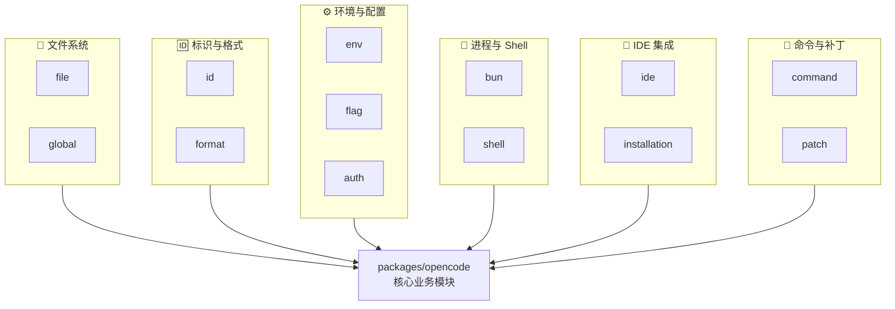

# 内部模块: 辅助基础设施

> 小型辅助模块的汇总说明。

本文档汇总了 `packages/opencode/src/` 中的辅助性基础设施模块。这些模块通常代码量少、功能单一，但对系统运行至关重要。



---

## 1. file/ (文件操作)

**核心文件**: `index.ts`, `ripgrep.ts`, `watcher.ts`, `ignore.ts`, `time.ts`

| 组件 | 功能 |
| :--- | :--- |
| `File` | 文件读写、编码检测 |
| `Ripgrep` | 封装 `rg` 命令进行代码搜索 |
| `Watcher` | 文件系统变更监听 |
| `Ignore` | .gitignore 规则解析 |
| `FileTime` | 文件时间戳工具 |

```typescript
// Ripgrep 搜索示例
const results = await Ripgrep.search({
  pattern: "function",
  path: Instance.directory,
  glob: ["*.ts", "*.js"],
})
```

---

## 2. global/ (全局路径)

**核心文件**: `index.ts`

定义系统级路径：

```typescript
export namespace Global {
  export const Path = {
    home: os.homedir(),                    // 用户主目录
    config: path.join(home, ".opencode"),  // 配置目录
    data: path.join(config, "data"),       // 数据目录
    cache: path.join(config, "cache"),     // 缓存目录
  }
}
```

---

## 3. id/ (ID 生成)

**核心文件**: `id.ts`

使用 ULID 生成有序唯一 ID：

```typescript
export namespace Identifier {
  // 创建带前缀的 ID
  export function create(prefix: string) {
    return `${prefix}_${ulid()}`
  }
  // 例如: session_01HQ7VXJX1ZCVPGCF6M1
  
  // 创建时间顺序 ID (用于排序)
  export function ascending(prefix: string) {
    return `${prefix}_${ulid()}`
  }
}
```

---

## 4. env/ (环境变量)

**核心文件**: `index.ts`

安全地读取环境变量：

```typescript
export namespace Env {
  export function get(key: string, fallback?: string): string {
    return process.env[key] ?? fallback ?? ""
  }
  
  export function require(key: string): string {
    const value = process.env[key]
    if (!value) throw new Error(`Missing env: ${key}`)
    return value
  }
}
```

---

## 5. flag/ (特性开关)

**核心文件**: `flag.ts`

管理运行时特性开关：

```typescript
export namespace Flag {
  // 环境变量开关
  export const OPENCODE_CONFIG = process.env.OPENCODE_CONFIG
  export const OPENCODE_DEBUG = process.env.OPENCODE_DEBUG === "true"
  export const OPENCODE_DISABLE_AUTOCOMPACT = process.env.OPENCODE_DISABLE_AUTOCOMPACT === "true"
}
```

---

## 6. format/ (格式化)

**核心文件**: `index.ts`

文本格式化工具：

```typescript
export namespace Format {
  // 代码块格式化
  export function codeBlock(code: string, language?: string) {
    return `\`\`\`${language || ""}\n${code}\n\`\`\``
  }
  
  // 文件大小格式化
  export function fileSize(bytes: number) {
    // 返回 "1.2 MB"
  }
}
```

---

## 7. shell/ (Shell 检测)

**核心文件**: `shell.ts`

检测用户首选 Shell：

```typescript
export namespace Shell {
  export function preferred(): string {
    // 优先使用 SHELL 环境变量
    const shell = process.env.SHELL
    if (shell) return shell
    
    // 回退到系统默认
    if (process.platform === "win32") return "cmd.exe"
    return "/bin/sh"
  }
}
```

---

## 8. auth/ (认证)

**核心文件**: `index.ts`

管理 API Key 和认证令牌：

```typescript
export namespace Auth {
  // 获取所有认证信息
  export async function all(): Promise<Record<string, AuthInfo>> {
    // 从配置和环境变量加载
  }
  
  // 存储令牌
  export async function store(provider: string, token: string) {
    // 安全存储到 keychain
  }
}
```

---

## 9. bun/ (Bun 进程管理)

**核心文件**: `index.ts`

封装 Bun 命令执行：

```typescript
export namespace BunProc {
  // 安装依赖
  export async function install(pkg: string, opts?: { cwd?: string }) {
    return run(["add", pkg], opts)
  }
  
  // 运行命令
  export async function run(args: string[], opts?: { cwd?: string }) {
    return $`bun ${args}`.cwd(opts?.cwd || process.cwd())
  }
}
```

---

## 10. installation/ (安装检测)

**核心文件**: `index.ts`

检测安装状态和版本：

```typescript
export namespace Installation {
  export const VERSION = "1.2.3"  // 当前版本
  
  export function isLocal() {
    return __dirname.includes("/src/")
  }
  
  export function isPreview() {
    return VERSION.includes("preview")
  }
}
```

---

## 11. ide/ (IDE 集成)

**核心文件**: `index.ts`

与 IDE 的集成支持：

```typescript
export namespace IDE {
  // 检测调用来源
  export function caller(): "vscode" | "zed" | "terminal" | "unknown" {
    const caller = process.env.OPENCODE_CALLER
    return caller || "terminal"
  }
}
```

---

## 12. command/ (命令抽象)

**核心文件**: `index.ts`

命令定义和执行：

```typescript
export namespace Command {
  export interface Definition {
    name: string
    template: string
    description?: string
    agent?: string
  }
  
  // 执行命令
  export async function execute(name: string, args: Record<string, string>) {
    const def = await get(name)
    const prompt = interpolate(def.template, args)
    // 发送给 Agent
  }
}
```

---

## 13. patch/ (补丁工具)

**核心文件**: `index.ts`

代码补丁生成和应用：

```typescript
export namespace Patch {
  // 生成 unified diff
  export function diff(before: string, after: string): string {
    return createPatch("file", before, after)
  }
  
  // 应用补丁
  export function apply(content: string, patch: string): string {
    return applyPatch(content, patch)
  }
}
```

---

## 总结

这些辅助模块共同构成了 OpenCode 的 **基础设施层**：

| 类别 | 模块 |
| :--- | :--- |
| **文件系统** | file, global |
| **标识与格式** | id, format |
| **环境与配置** | env, flag, auth |
| **进程与 Shell** | bun, shell |
| **IDE 集成** | ide, installation |
| **命令与补丁** | command, patch |

它们的特点是：
- 代码量小 (每个通常 < 200 行)
- 功能单一、职责明确
- 被上层业务模块广泛依赖
- 没有复杂的状态管理
