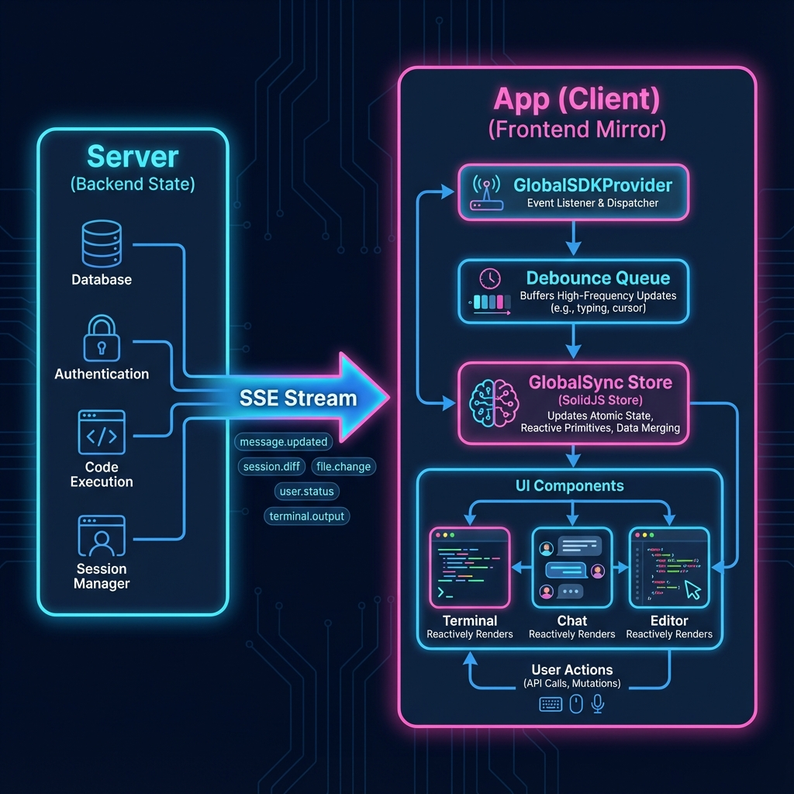

# 包分析: `app`

## 1. 概览 (Overview)
- **路径**: `packages/app`
- **定位**: OpenCode 的 Web 前端界面。
- **技术栈**: 
    - **Framework**: SolidJS
    - **Build**: Vite
    - **Styling**: TailwindCSS
    - **Terminal**: Ghostty Web
## 1. 概览 (Overview)
- **路径**: `packages/app`
- **定位**: OpenCode 的 Web 前端界面。
- **技术栈**: 
    - **Framework**: SolidJS
    - **Build**: Vite
    - **Styling**: TailwindCSS
    - **Terminal**: Ghostty Web
- **依赖**: `@opencode-ai/sdk`, `@opencode-ai/ui`。



## 2. 核心架构 (Core Architecture)

App 采用了 **Server-Driven UI** 和 **Reactive State Sync** 的架构模式。

### 2.1 状态同步引擎 (State Sync Engine)
前端几乎不维护独立的复杂业务状态，而是作为一个 **镜像 (Mirror)** 实时反映 Server 端的状态。核心逻辑在 `src/context/global-sync.tsx`。

1.  **事件驱动**: `GlobalSDKProvider` 建立 SSE 连接 (`/global/event`)。
2.  **事件合并**: 为了性能，高频事件（如 `message.part.updated` 流式输出）会在前端进行缓冲和合并 (Debounce/Coalesce)。
3.  **God Store**: `GlobalSyncProvider` 维护了一个巨大的 SolidJS Store，包含所有会话、消息、文件、终端状态。
    ```typescript
    type State = {
      status: "loading" | "partial" | "complete"
      session: Session[]
      message: { [sessionID: string]: Message[] } // 消息列表
      session_diff: { [sessionID: string]: FileDiff[] } // 变更差异
      // ...
    }
    ```
4.  **自动更新**: 当 Server 推送 `message.updated` 事件时，Store 自动更新，SolidJS 的细粒度响应式系统会精确更新 UI 中的对应 DOM 节点，无需 React 式的 Diff。

### 2.2 路由与布局 (Routing & Layout)
- **Home (`/`)**: 项目列表和欢迎页。
- **Workspace (`/:dir`)**: 进入特定项目目录。
    - **Session (`/:dir/session/:id`)**: 核心工作区。
        - **左侧**: 会话列表 (`SessionMessageRail`)。
        - **中间**: 对话流 (`SessionTurn`) 和 代码编辑器 (`CodeComponentProvider`)。
        - **右侧/底部**: 终端 (`Terminal`) 和 变更审查 (`SessionReview`)。

### 2.3 关键组件
- **`Terminal`**: 集成了 `ghostty-web`，通过 WebSocket 连接到后端 PTY。
- **`PromptInput`**: 用户的指令输入框。
- **`SessionReview`**: 可视化展示文件变更 Diff，支持 Unified/Split 视图。

## 3. 总结
`packages/app` 是一个典型的 **"Thin Client, Fat Server"** 实现。
- 它极度依赖 `@opencode-ai/sdk` 提供的实时数据流。
- 它的复杂度主要在于 **如何高效地将高频服务端事件渲染为流畅的 UI** (利用 SolidJS 的高性能更新)。
- 这种架构使得前端非常轻量，且天然支持多人协作（因为状态都在 Server，前端只是 View）。
