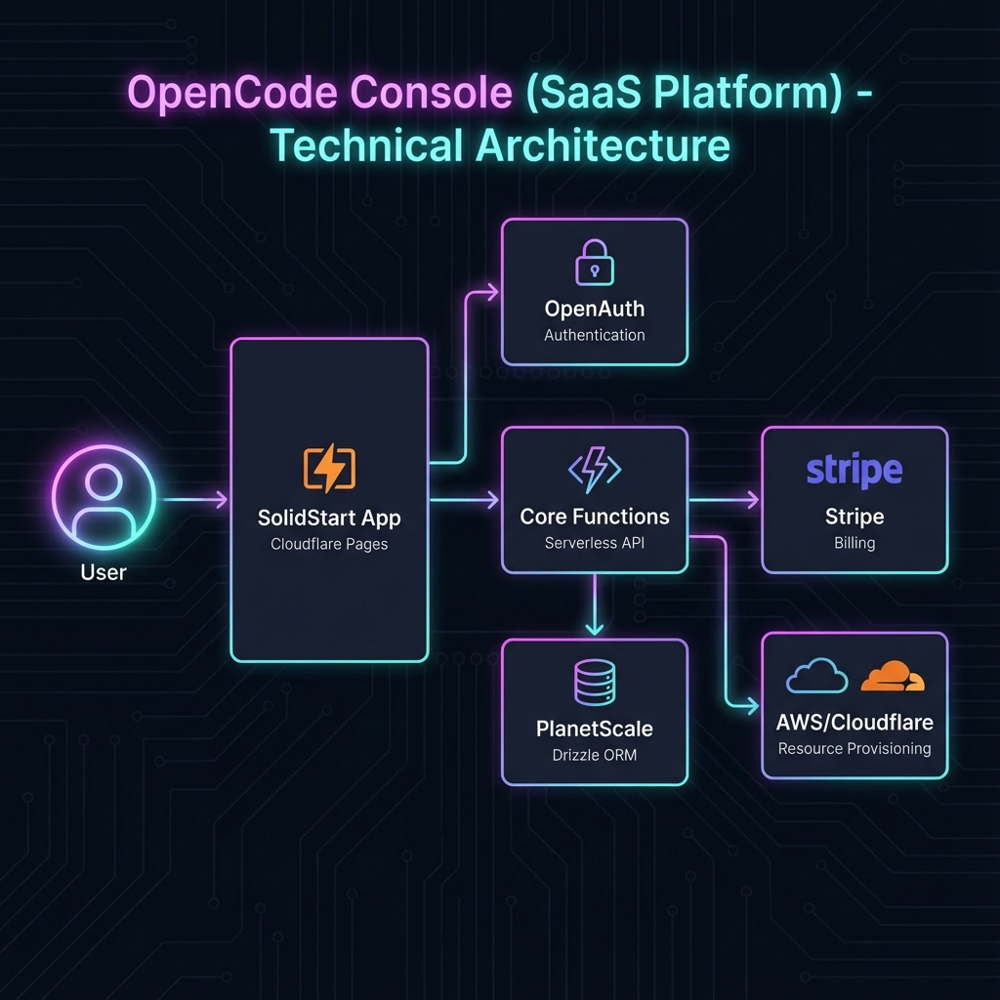

# 包分析: `console`

> [!NOTE]
> 这是一个 **包组 (Package Group)**，包含多个子包。

## 1. 概览 (Overview)
- **路径**: `packages/console`
- **定位**: OpenCode 的 SaaS 管理后台与云服务基础设施。
- **架构**: 基于 SST (Serverless Stack) 和 SolidStart 构建的全栈应用。

## 2. 子包结构 (Sub-packages)

| 子路径 | 包名 | 描述 |
| :--- | :--- | :--- |
| `app` | `@opencode-ai/console-app` | **主应用**。基于 SolidStart，部署到 Cloudflare。 |
| `core` | `@opencode-ai/console-core` | **核心逻辑**。数据库模型、业务逻辑。 |
| `mail` | `@opencode-ai/console-mail` | **邮件服务**。Transactional Email 模板与发送。 |
| `function` | `@opencode-ai/console-function` | **云函数**。后台异步任务。 |
| `resource` | `@opencode-ai/console-resource` | **云资源**。SST 定义的 AWS/Cloudflare 资源。 |

## 3. 核心架构 (Core Architecture)

`packages/console` 采用了典型的 **Serverless Fullstack** 架构。

### 3.1 基础设施 (Infrastructure)
- **SST (Serverless Stack)**: 用于定义基础设施即代码 (IaC)。
- **Cloudflare**: 主要部署目标。`app` 部署为 Edge Function 或 Static Site。
- **OpenAuth**: 独立部署的身份认证服务。

### 3.2 数据层 (Data Layer)
`packages/console/core` 是数据访问层 (DAL)。
- **ORM**: **Drizzle ORM**.
- **Database**: **PlanetScale** (Serverless MySQL).
- **Schema**: 包含 `User`, `Workspace`, `Billing` (Stripe集成), `Key` (API密钥管理)。

### 3.3 应用层 (Application Layer)
`packages/console/app` 是面向用户的 SaaS 前端。
- **SolidStart**: 利用 SSR 提供更好的首屏性能 (相对于 App 的 CSR)。
- **路由**: 文件系统路由，管理 `/settings`, `/billing`, `/team` 等页面。
