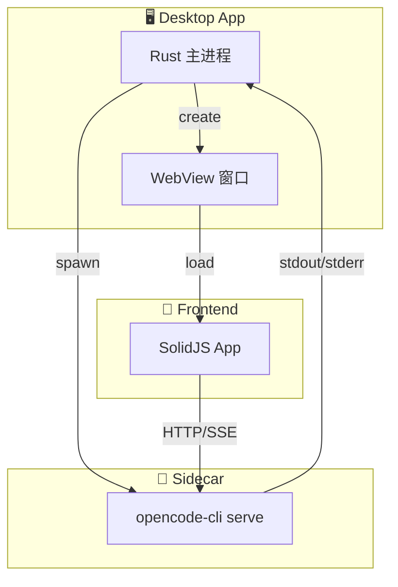

# 包分析: `desktop`

> OpenCode 的桌面端应用。

## 1. 概览 (Overview)
- **路径**: `packages/desktop`
- **定位**: OpenCode 的桌面端应用，提供原生体验。
- **技术栈**: 
    - **Frontend**: SolidJS + Vite (复用 `@opencode-ai/app`)
    - **Core**: Tauri 2.0 (Rust)
- **依赖**: `@tauri-apps/api`, `@tauri-apps/plugin-*`

## 2. 核心架构

Desktop 端采用了经典的 **Tauri + Sidecar** 模式。



## 3. 启动流程 (Startup Flow)

### 3.1 Rust 主进程启动 (`src-tauri/src/lib.rs`)

```rust
// 1. 检查 Server 是否已运行
let port = check_running_server();

// 2. 如果未运行，启动 Sidecar
if port.is_none() {
    let sidecar = spawn_sidecar("opencode-cli", &["serve"]);
    // 重定向日志到 LogState
    sidecar.stdout.pipe(log_state);
}

// 3. 创建 WebView 窗口
let window = WebviewWindowBuilder::new("main", url)
    .title("OpenCode")
    .build()?;
```

### 3.2 前端初始化 (`src/index.tsx`)

```typescript
// 复用 App 组件
import { App } from "@opencode-ai/app"

// 注入 Tauri 特有能力
<PlatformProvider platform={tauriPlatform}>
  <App />
</PlatformProvider>
```

## 4. Sidecar 机制

Tauri 应用本身是个轻量级壳，真正的业务逻辑全部由 `opencode-cli` 二进制文件承载。

| 组件 | 职责 |
| :--- | :--- |
| **Tauri (Rust)** | 窗口管理、系统集成、进程管理 |
| **opencode-cli** | Agent、Session、LSP、所有业务逻辑 |
| **Web App** | UI 渲染，与 CLI Server 通信 |

**优势**: 一套核心代码，两套分发方式 (CLI/Desktop)，维护成本极低。

## 5. CLI 集成 (`cli.rs`)

Desktop 应用还承担了 **Installer** 的角色：

```rust
pub async fn install_cli() -> Result<()> {
    // 1. 检测系统中是否安装了 opencode CLI
    let existing = which::which("opencode");
    
    // 2. 如果没有或版本过低
    if existing.is_err() || needs_update() {
        // 3. 将内置的 sidecar binary 安装到用户的 PATH
        let bin_path = get_install_path()?;
        fs::copy(sidecar_path, bin_path)?;
    }
}
```

用户安装了桌面版，同时也自动获得了最新的命令行工具！

## 6. 关键特性

### 6.1 原生能力桥接

`src/index.tsx` 实现了 `Platform` 接口：

```typescript
const tauriPlatform: Platform = {
  // 原生文件选择对话框
  pickFile: () => dialog.open({ multiple: false }),
  
  // 系统通知
  notify: (msg) => notification.send(msg),
  
  // 剪贴板
  copyToClipboard: (text) => clipboard.writeText(text),
}
```

### 6.2 自动更新

集成了 `tauri-plugin-updater`：

```rust
#[tauri::command]
async fn check_update(app: AppHandle) -> Result<UpdateInfo> {
    let updater = app.updater()?;
    updater.check().await
}
```

### 6.3 日志诊断

所有的 Server 日志都被捕获：

```rust
struct LogState {
    logs: Vec<String>,
}

// 用户可以通过界面上的 "Copy Logs" 按钮导出排错
#[tauri::command]
fn get_logs(state: State<LogState>) -> Vec<String> {
    state.logs.clone()
}
```

## 7. 构建与发布

```bash
cd packages/desktop

# 开发模式
bun tauri dev

# 构建发布版本
bun tauri build
# 输出:
# - macOS: .dmg, .app
# - Windows: .msi, .exe
# - Linux: .deb, .AppImage
```

## 8. 总结

`packages/desktop` 是 OpenCode 的 **原生壳**：
- **跨平台**: 通过 Tauri 支持 macOS/Windows/Linux
- **高效复用**: 前端完全复用 `@opencode-ai/app`
- **自动安装**: 桌面版自带 CLI 安装功能
- **深度集成**: 原生通知、文件对话框、自动更新
