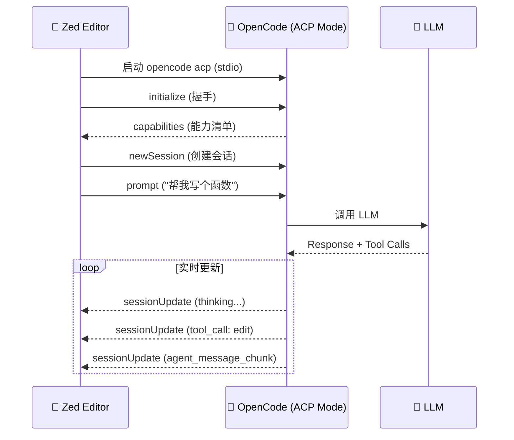

# 包分析: `extensions`

> OpenCode 的编辑器扩展集合。

## 1. 概览 (Overview)
- **路径**: `packages/extensions`
- **定位**: 为各种编辑器提供 OpenCode Agent 集成。
- **当前支持**: Zed

## 2. Zed 扩展 (`extensions/zed`)

### 2.1 什么是 Zed？
[Zed](https://zed.dev) 是一款高性能代码编辑器，原生支持 **Agent Client Protocol (ACP)**，可以无缝嵌入 AI Agent。

### 2.2 扩展配置 (`extension.toml`)

```toml
id = "opencode"
name = "OpenCode"
description = "The open source coding agent."
version = "1.1.3"
schema_version = 1
authors = ["Anomaly"]
repository = "https://github.com/anomalyco/opencode"

[agent_servers.opencode]
name = "OpenCode"
icon = "./icons/opencode.svg"

# 多平台支持
[agent_servers.opencode.targets.darwin-aarch64]
archive = "https://github.com/.../opencode-darwin-arm64.zip"
cmd = "./opencode"
args = ["acp"]  # 关键: 使用 ACP 模式

[agent_servers.opencode.targets.linux-x86_64]
archive = "https://github.com/.../opencode-linux-x64.tar.gz"
cmd = "./opencode"
args = ["acp"]
```

### 2.3 工作原理



### 2.4 ACP 模式解析

当执行 `opencode acp` 时，OpenCode 进入 **Agent Client Protocol** 模式：

1. **传输层**: 使用 `stdio` (标准输入/输出) 进行通信
2. **协议**: 基于 `ndjson` (Newline Delimited JSON)
3. **角色**: OpenCode 作为 **Server**，Zed 作为 **Client**

**核心接口** (来自 `src/acp/agent.ts`):

```typescript
class ACP.Agent implements Agent {
  // 握手
  initialize(): capabilities

  // 会话管理
  newSession(): sessionID
  
  // 核心交互
  prompt(sessionID, content): void
  
  // 事件推送
  on("sessionUpdate", (event) => {
    // tool_call, agent_message_chunk, etc.
  })
}
```

### 2.5 与 VS Code 扩展的对比

| 特性 | Zed (ACP) | VS Code (HTTP) |
| :--- | :--- | :--- |
| **协议** | Agent Client Protocol | 自定义 HTTP |
| **传输** | stdio (JSON-RPC) | HTTP REST |
| **启动** | Zed 管理进程 | 扩展创建终端 |
| **依赖** | 下载预编译二进制 | 用户需提前安装 CLI |
| **集成深度** | 原生 Agent UI | 嵌入式终端 |

### 2.6 安装方式

1. 在 Zed 中打开 Extensions
2. 搜索 "OpenCode"
3. 点击 Install
4. Zed 会自动下载对应平台的二进制文件

## 3. 目录结构

```
extensions/
└── zed/
    ├── extension.toml   # Zed 扩展配置
    ├── LICENSE
    └── icons/
        └── opencode.svg  # 扩展图标
```

## 4. 总结

Zed 扩展体现了 OpenCode 的协议开放性：
- **CLI 复用**: 同一个二进制文件支持多种模式 (`serve`, `acp`, `run`)
- **协议标准**: 采用 ACP 标准，便于未来扩展到其他支持 ACP 的编辑器
- **零代码维护**: 扩展本身只是一个配置文件，逻辑全在 CLI 中
