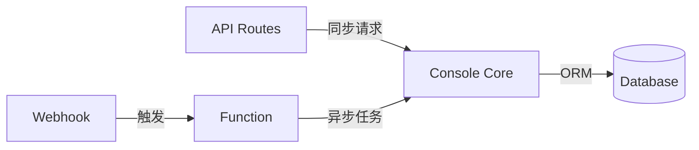

# 包分析: `function`

> OpenCode Console 的云函数定义。

## 1. 概览 (Overview)
- **路径**: `packages/function`
- **定位**: 定义 Console 后台异步任务的 Lambda 函数。
- **技术栈**: SST (Serverless Stack) + TypeScript
- **部署目标**: AWS Lambda

## 2. 架构位置

```
packages/console/
├── app/       # 前端 + API Routes
├── core/      # 业务逻辑 + 数据层
├── function/  # ← 后台任务 (Lambda)
├── mail/      # 邮件模板
└── resource/  # 基础设施定义
```

## 3. 典型用例

Console 中的 Function 通常用于：

| 场景 | 触发方式 | 描述 |
| :--- | :--- | :--- |
| **计费处理** | Stripe Webhook | 处理订阅变更、发票生成 |
| **邮件发送** | 事件触发 | 异步发送注册确认、通知邮件 |
| **数据清理** | 定时任务 | 清理过期会话、日志归档 |
| **统计更新** | 事件触发 | 更新使用量统计、仪表盘数据 |

## 4. SST 配置示例

在 `sst.config.ts` 或 `infra/console.ts` 中定义：

```typescript
// 定义 Function
const stripeWebhook = new sst.Function({
  handler: "packages/function/src/stripe.handler",
  link: [db, stripeSecret],  // 链接其他资源
})

// 绑定到 API
api.route("POST /webhook/stripe", stripeWebhook)
```

## 5. 目录结构

```
function/
├── package.json
├── tsconfig.json
├── sst-env.d.ts    # SST 类型定义
└── src/
    └── index.ts    # 函数入口
```

## 6. 与 Console Core 的关系



- **Console Core**: 共享业务逻辑层
- **Function**: 长时间运行的任务，避免阻塞 API

## 7. 总结

`packages/function` 是 Console 的异步工作引擎：
- **事件驱动**: 响应 Webhook、队列消息
- **资源隔离**: 独立的 Lambda 执行环境
- **按需付费**: Serverless 计费模式

对于学习 OpenCode 的核心 Agent 逻辑，这个包优先级较低，但对于理解 SaaS 后端架构有参考价值。
