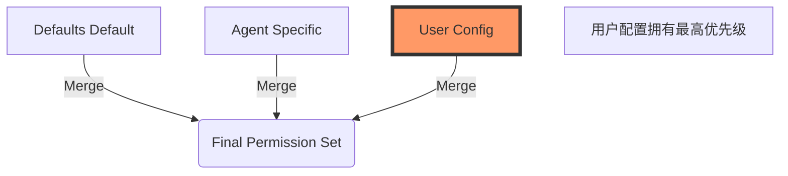

# Module 1: 大脑 - Agent 与权限
> **目标**: 理解 OpenCode 如何定义其智能体 (Agent)，以及安全沙箱是如何限制它们的。

---

## 1. 多 Agent 架构 (Multi-Agent Architecture)

与简单的聊天机器人不同，OpenCode 采用 **多 Agent 系统**，由专门的 Agent 处理不同类型的任务。此逻辑定义在 `src/agent/agent.ts` 中。

### 内置 Agents

| Agent | 模式 | 角色与能力 | 原生? |
| :--- | :--- | :--- | :--- |
| **`build`** | `primary` | **通才 (The Generalist)**。处理编程任务的默认 Agent。拥有读写文件和执行命令的广泛权限。 | ✅ |
| **`plan`** | `primary` | **架构师 (The Architect)**。专门管理 `.opencode/plan/*.md` 文件。它负责创建和更新实施计划，但*不能*直接修改源代码。 | ✅ |
| **`explore`** | `subagent` | **侦察兵 (The Scout)**。专为代码库探索设计的只读 Agent。它使用 `grep`, `glob`, `websearch` 和 `lsp` 来回答问题，但严禁写入文件。 | ✅ |
| **`general`** | `subagent` | **研究员 (The Researcher)**。处理非编程的复杂任务。可以联网搜索和推理，但不能触碰项目的 TODO。 | ✅ |
| **`compaction`** | `primary` | **图书管理员 (The Librarian)**。一个隐藏的 Agent，负责在上下文过长时压缩历史记录。 | ✅ |
| **`title/summary`** | `primary` | **书记员 (The Scribe)**。隐藏的 Agent，在后台生成会话标题和摘要。 | ✅ |

### `Agent.Info` 模式定义
每个 Agent 都由严格的 Schema (`zod`) 定义：

```typescript
export const Info = z.object({
  name: z.string(),
  mode: z.enum(["subagent", "primary", "all"]),
  native: z.boolean().optional(),
  hidden: z.boolean().optional(),
  permission: PermissionNext.Ruleset, // <--- 安全策略 (The Security Policy)
  model: z.object({ ... }).optional(), // <--- 特定模型覆盖
  prompt: z.string().optional(),       // <--- 系统提示词 (System Prompt)
})
```

---

## 2. 权限系统 (The Permission System)

OpenCode 实行“安全优先”的设计。默认情况下不信任 Agent；它们在一个严格的 **权限沙箱 (Permission Sandbox)** 中运行。

**源码**: `src/permission/`

### 2.1 规则层级 (Rule Hierarchy)

权限从三个层级合并（优先级从低到高）：

1.  **默认 (Defaults - 硬编码)**: 定义在 `src/agent/agent.ts`。
    - 例如：`doom_loop: "ask"`, `external_directory: "ask"`。
2.  **Agent 特有 (Agent Specifics)**: 定义在 Agent 的定义中。
    - 例如：`explore` Agent 显式对 `*` (所有写操作) 设置为 `deny`。
3.  **用户配置 (User Config)**: 定义在你的 `opencode.json` 或全局配置中。
    - 用户覆盖永远拥有最高优先级。

### 2.2 权限状态 (Permission States)

| 状态 | 行为 |
| :--- | :--- |
| **`allow`** | 工具立即执行，无需提示用户。 |
| **`ask`** | CLI/UI 创建一个 **阻塞式中断**，等待用户批准。 |
| **`deny`** | 工具执行立即被阻止。Agent 会收到一个 "Access Denied" 错误。 |

### 2.3 核心权限域 (Permission Scopes)
以下是系统中定义的常见权限关键字：

| 域 (Scope) | 描述 | 默认策略 |
| :--- | :--- | :--- |
| **`read`** | 读取文件内容。 | `allow` (除了 `.env` 文件) |
| **`edit`** | 修改或创建文件 (`write`, `patch`, `multiedit`)。 | 取决于 Agent (如 `explore` 为 `deny`) |
| **`bash`** | 执行 Shell 命令。 | `deny` (除 `build` Agent) |
| **`webfetch`** | 发起 HTTP 请求 (GET)。 | `allow` |
| **`websearch`** | 使用搜索引擎。 | `allow` |
| **`doom_loop`** | **死循环检测**。当 Agent 重复执行失败操作时触发。 | `ask` (暂停并询问用户) |
| **`external_directory`** | 访问工作区以外的目录。 | `ask` |

> [!NOTE]
> **敏感文件保护**: OpenCode 默认将 `*.env` 和 `*.env.*` 文件的读取权限设为 `deny`，防止密钥泄露。你必须显式配置才能允许读取。

### 2.4 深度解析：权限合并逻辑 (Permission Logic)

OpenCode 并不是简单地覆盖权限，而是通过 `PermissionNext.merge(defaults, agent, user)` 进行三层合并。



#### 代码实战：`explore` Agent 的定义

让我们直接看 `src/agent/agent.ts` 的源码，看看它是如何被“锁死”在只读模式的：

```typescript
// src/agent/agent.ts
explore: {
  // ...
  permission: PermissionNext.merge(
    defaults,
    PermissionNext.fromConfig({
      "*": "deny",            // 1. 【安全基线】默认拒绝一切操作
      grep: "allow",          // 2. 【白名单】仅允许无副作用的读取工具
      glob: "allow",
      websearch: "allow",
      codesearch: "allow",
      read: "allow",
    }),
    user // 3. 用户配置可以覆盖上述设定
  ),
  description: `Fast agent specialized for exploring codebases...`,
  mode: "subagent",
}
```

---

## 3. 自定义 Agent (Customizing Agents)

你可以在 `.opencode/agent/*.json` 或 `opencode.json` 中定义自己的 Agent。

**示例：一个 "Writer" Agent**
```json
// opencode.json
{
  "agent": {
    "writer": {
      "model": "anthropic/claude-3-opus",
      "prompt": "You are a technical writer. Focus on documentation.",
      "permission": {
        "read": { "*.md": "allow" },
        "write": { "*.md": "allow", "*": "deny" }
      }
    }
  }
}
```

## 下一步 (Next Step)
现在我们了解了大脑，接下来学习如何通过命令行控制它们。
👉 [Module 2: 接口 - CLI 深度精通](./02-cli-mastery.md)
