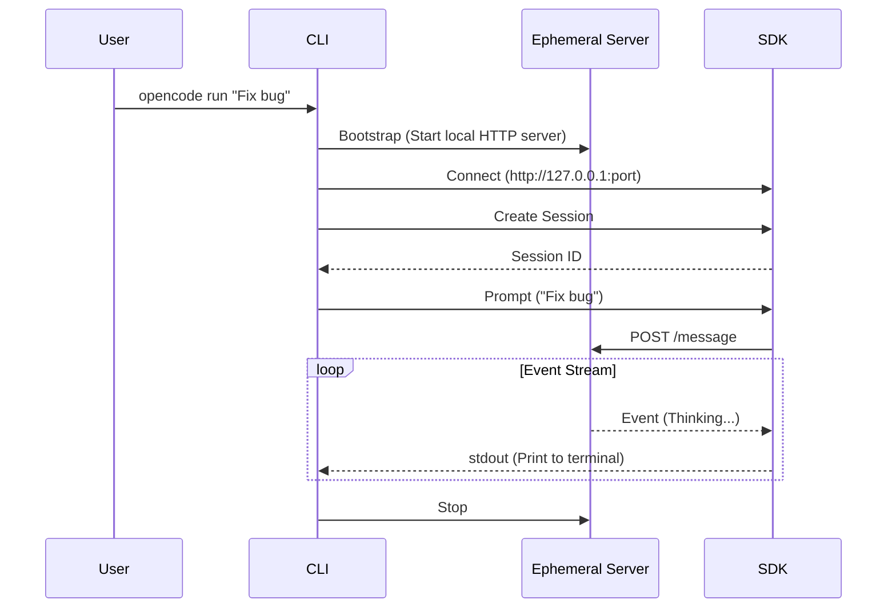

# Module 2: 接口 - CLI 深度精通

> **目标**: 精通 `opencode` 命令行接口及其各种运行模式。

---

## 1. 命令结构 (The Command Structure)

CLI 基于 `yargs` 构建，位于 `src/cli/cmd/`。它是所有交互的主要入口点。

### 核心命令

| 命令 | 用法 | 描述 | 源码 |
| :--- | :--- | :--- | :--- |
| **`opencode`** | `opencode` | **交互模式**。启动 TUI (终端 UI) 进行类聊天会话。 | `src/cli/cmd/agent.ts` |
| **`run`** | `opencode run "Prompt"` | **单次模式 (One-Shot)**。执行单个提示词并退出。非常适合脚本化。 | `src/cli/cmd/run.ts` |
| **`batch`** | `opencode batch scripts/` | **批处理模式 (Batch Mode)**。运行文件中定义的一系列任务。 | `src/cli/cmd/batch.ts` |
| **`pr`** | `opencode pr <url>` | **评审模式 (Review Mode)**。分析 GitHub PR 或 Issue。 | `src/cli/cmd/pr.ts` |
| **`serve`** | `opencode serve` | **服务模式 (Server Mode)**。启动一个 MCP Server，允许其他工具调用 OpenCode。 | `src/cli/cmd/serve.ts` |
| **`share`** | `opencode share` | **协作**。将当前会话上传到云端以进行分享。 | `src/cli/cmd/share.ts` |

---

## 2. 深度解析：`opencode run`

这是最常见的自动化工作流。

### 深度图解：`opencode run` 的生命周期

当你在终端输入命令时，幕后发生了一场精密的接力赛：



**实战输出示例**

这是 `printEvent` 函数渲染出的实际效果（模拟）：

```text
$ opencode run "Read package.json"

|  Bash    ls -F
|  Glob    package.json
|  Read    package.json
|  Think   I found the file. It is version 1.0.0.

{
  "name": "opencode",
  "version": "1.0.0"
}
```

## 3. 深度解析：`opencode batch`

对于复杂的迁移或重复性任务，“批处理模式”非常强大。

**工作原理**:
1.  你编写一个 markdown 或文本文件作为指令。
2.  `opencode batch` 读取文件。
3.  它将每个文件视为一个独立的 **Runner**。
4.  它执行这些 Runner，可能并行运行。

**示例批处理文件 (`migration.Prompt`)**:
```text
1. Read package.json
2. Update the version of "react" to "18.0.0"
3. Run "npm install"
4. Check for build errors
```

## 4. 深度解析：`opencode serve` (MCP Server)

此命令将 CLI 转换为一个 **Server**。它通过 `stdio` 实现了 **Model Context Protocol (MCP)**。

**这有什么用？**
它允许 **Claude Desktop** 或其他 MCP 客户端将 OpenCode 当作一个工具来使用！
在此模式下运行时，OpenCode 将其能力（读取文件、搜索代码）暴露为 MCP Tools，供 Claude 调用。

---

## 5. TUI (终端 UI)

默认的 `opencode` 命令启动了一个由 `@opentui` 组件构建的丰富 TUI。

**关键特性**:
-   **Slash 命令**: 输入 `/` 查看可用动作（如 `/clear`, `/model`, `/agent`）。
-   **多行输入**: 轻松粘贴大段代码块。
-   **Spinner & 进度**: 工具执行的可视化指示器。
-   **历史记录**: 按向上箭头召回上一个命令。

## 下一步 (Next Step)
你知道了如何与 Agent 对话。现在让我们看看 Agent 实际上能 *做* 什么。
👉 [Module 3: 手脚 - 工具与原子能力](./03-tools-and-capabilities.md)
