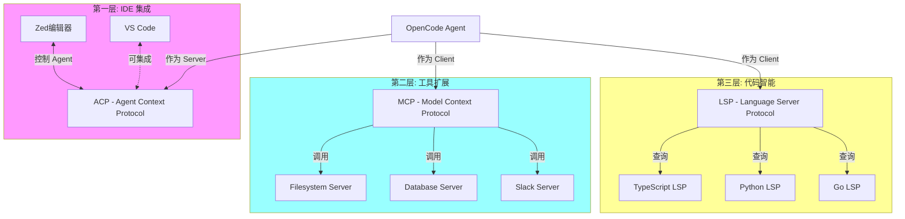
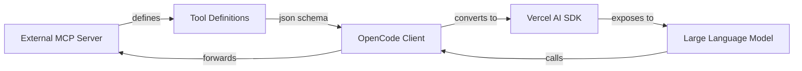

# Module 4: 生态 - 三层协议栈

> **目标**: 理解 OpenCode 如何通过 **ACP、MCP、LSP** 三层协议实现全方位扩展。

---

## 0. 三层协议栈总览

OpenCode 通过三个标准协议构建了完整的生态系统：



### 协议对比

| 协议 | OpenCode 角色 | 功能 | 示例 |
|------|---------------|------|------|
| **ACP** | Server | 被 IDE 控制，接收用户指令 | Zed 编辑器集成 |
| **MCP** | Client | 调用外部工具，扩展能力 | Slack 消息、数据库查询 |
| **LSP** | Client | 理解代码结构，语义搜索 | 跳转定义、查找引用 |

详细文档：
- [→ ACP 协议详解](../../concepts/acp.md)
- [→ MCP 协议详解](../../concepts/mcp.md)
- [→ LSP 协议详解](../../concepts/lsp.md)

---

## 1. MCP (Model Context Protocol) - 作为 Client

**模块**: `src/mcp/`

OpenCode 全面支持 **Model Context Protocol (MCP)**，这允许它动态地“挂载”外部工具。

### 概念
OpenCode 不必硬编码每个集成（如 Jira, Slack, PostgreSQL），而是可以连接到任何运行的 MCP Server。

### 分析：`src/mcp/index.ts`
该文件充当桥梁：
1.  **连接**: 它支持 `StdioClientTransport` (本地子进程) 和 `SSEClientTransport` (远程 URL)。
2.  **转换**: 它实现了 `convertMcpTool` 函数，这是魔法发生的地方：

```typescript
// src/mcp/index.ts
// 将 MCP 工具定义转换为 Vercel AI SDK 工具
async function convertMcpTool(mcpTool: MCPToolDef, client: MCPClient): Promise<Tool> {
  // 1. 获取 MCP 定义的 Input Schema
  const inputSchema = mcpTool.inputSchema as JSONSchema7
  
  // 2. 包装为 Vercel dynamicTool
  return dynamicTool({
    description: mcpTool.description ?? "",
    inputSchema: jsonSchema(inputSchema),
    // 3. 当 LLM 调用时，转发请求给 MCP Client
    execute: async (args) => {
      return client.callTool({
        name: mcpTool.name,
        arguments: args
      })
    },
  })
}
```

### 数据流向图



### 用法
你可以在 `opencode.json` 中配置 MCP Server：
```json
{
  "mcpServers": {
    "filesystem": {
      "command": "npx",
      "args": ["-y", "@modelcontextprotocol/server-filesystem", "/Users/me/data"]
    }
  }
}
```

---

## 2. ACP (Agent Client Protocol) - 作为 Server

**模块**: `src/acp/`

**ACP** 是一个允许 IDE（如 Zed）“驱动” Agent 的协议。这种场景下，OpenCode 充当后端服务。

### 分析：`src/acp/agent.ts`
此类实现了服务端逻辑：
1.  **握手**: 它通告其能力（例如，“我支持工具执行和流式传输”）。
2.  **会话映射**: 它将传入的 ACP 会话映射到内部的 OpenCode `Session`。
3.  **事件转发**: 当内部 Agent 思考（生成 token）或行动（调用工具）时，`ACP.Agent` 捕获这些事件，并通过 ACP 协议经由 `json-rpc` 将它们推送给 IDE。

这就是为什么你能看到 OpenCode 的推理过程直接出现在 Zed 编辑器的 UI 中。

---

## 3. LSP (Language Server Protocol) - 代码智能

**模块**: `src/lsp/`

**LSP** 让 OpenCode 拥有像 IDE 一样的代码理解能力。

### 核心功能

| LSP 方法 | 功能 | OpenCode 用途 |
|----------|------|--------------|
| `workspace/symbol` | 全局符号搜索 | 查找类/函数定义 |
| `textDocument/definition` | 跳转定义 | 精确定位符号 |
| `textDocument/references` | 查找引用 | 找到所有调用点 |
| `textDocument/documentSymbol` | 文档结构 | 获取文件大纲 |

### vs grep 的优势

```typescript
// ❌ grep: 文本搜索（不准确）
grep -r "class AuthService"
// 问题: 
// - 匹配注释中的 "class AuthService"
// - 匹配字符串 "class AuthService is..."
// - 无法区分定义和使用

// ✅ LSP: 语义搜索（100% 准确）
codesearch({ query: "AuthService", kind: "class" })
// 返回:
{
  name: "AuthService",
  kind: "Class",
  location: {
    file: "src/auth/service.ts",
    line: 10,
    character: 6
  }
}
```

### 支持的语言

OpenCode 自动为以下语言启动 LSP Server：

- **TypeScript/JavaScript** - `typescript-language-server`
- **Python** - `pyright`
- **Go** - `gopls`
- **Rust** - `rust-analyzer`
- **Java** - `jdtls`
- **C/C++** - `clangd`
- **Ruby** - `solargraph`
- **PHP** - `intelephense`
- ...还有 20+ 种语言

### 配置示例

```json
// opencode.json
{
  "lsp": {
    "typescript": {
      "enabled": true
    },
    "pyright": {
      "disabled": true  // 禁用 Python LSP
    }
  }
}
```

**更多详情**: [LSP 协议完整文档](../../concepts/lsp.md)

---

## 4. 插件系统 (The Plugin System)

**模块**: `packages/plugin/` (在 `opencode` 核心中引用)

除了协议，OpenCode 还支持原生的插件系统。
插件可以：
-   注入自定义 **工具 (Tools)**。
-   添加 **钩子 (Hooks)** (例如 `tool.execute.before` 以拦截动作)。
-   注册 **Agent**。

这允许进行超越简单工具添加的深度定制，甚至改变运行时的行为。

---

## 系列总结 (Series Conclusion)

祝贺！你已经游览了 `packages/opencode` 的内部机制。
现在你明白了：
1.  **Agents** 只是带有权限集的特殊配置。
2.  **CLI** 是本地 Hono Server 的一层薄封装。
3.  **Tools** 是通往操作系统的桥梁，由 LSP 和 Worktrees 赋能。
4.  **Protocols** (MCP/ACP) 带来了无限的扩展性。

返回 [架构总览](./README.md)
