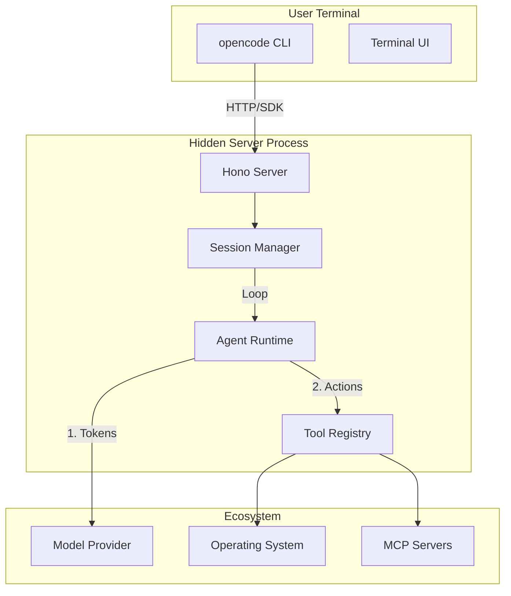

# Module 0: OpenCode 架构总览
> **深度解密系列**:
> 这是 **"OpenCode 内核揭秘"** 系列课程的 **Module 0**。
>
> 1.  [🤖 Module 1: 大脑 - Agent 与权限](./01-agents-and-permissions.md)
> 2.  [⌨️ Module 2: 接口 - CLI 深度精通](./02-cli-mastery.md)
> 3.  [🛠️ Module 3: 手脚 - 工具与原子能力](./03-tools-and-capabilities.md)
> 4.  [🔌 Module 4: 生态 - MCP 与 ACP 协议](./04-extensions-protocols.md)

---

## 1. 概览 (Overview)
- **路径**: `packages/opencode`
- **定位**: OpenCode Monorepo 的核心引擎。
- **职责**: 它编排了整个智能闭环——管理会话、将 LLM 的决策转化为操作系统指令，并充当 CLI 的统一入口。

## 2. 系统架构 (System Architecture)

该架构采用 **Client-Server-Agent** 三层模型：



`opencode` 包采用 **本地 Client-Server** 架构。即使你在终端运行它，它也会在后台启动一个隐藏的服务器来管理状态。

### 关键生命周期 (Key Lifecycle Phases)

1.  **引导 (Bootstrap)**: CLI (`src/cli`) 启动一个本地 Hono Server (`src/server`)。
2.  **连接 (Connect)**: CLI 通过内部 SDK 连接到该 Server。
3.  **思考 (Think)**: Server 初始化 `SessionPrompt` 循环 (`src/session/prompt.ts`)，向 LLM 发起查询。
4.  **行动 (Act)**: LLM 请求执行工具，由工具注册表 (`src/tool`) 处理。
5.  **持久化 (Persist)**: 所有状态被保存为 JSON 文件 (`src/storage`)。

## 3. 目录结构导航 (Directory Structure Map)

理解源码 (`src/`) 布局是导航的关键：

| 目录 | 角色 | 关键组件 |
| :--- | :--- | :--- |
| **`agent/`** | **定义** | 内置 Agents (`build`, `explore`) 及其配置。 |
| **`cli/`** | **接口** | `yargs` 命令 (`run`, `batch`) 和 TUI 逻辑。 |
| **`tool/`** | **能力** | 原生工具 (`bash`, `webfetch`) 和注册表。 |
| **`session/`**| **状态** | 逻辑/Prompt 循环, 上下文压缩, 消息历史。 |
| **`mcp/`** | **协议** | Model Context Protocol 客户端实现。 |
| **`server/`** | **后端** | Hono HTTP Server 路由。 |
| **`provider/`**| **大模型** | OpenAI, Anthropic, Gemini 的适配器。 |
| **`worktree/`**| **沙箱** | 用于安全代码编辑的 Git Worktree 管理。 |
| **`lsp/`** | **智能** | Language Server Protocol 客户端管理器。 |

---

## 4. 核心代码导读 (Core Code Tour)

除了上文提到的 Server 架构，OpenCode 的魔力还隐藏在以下几个核心文件中。深入阅读这些代码，你将理解 Agent 是如何思考和行动的。

### 4.1. The Loop: 思考的闭环 (`src/session/prompt.ts`)
这是 Agent 的主循环逻辑。它不断地将历史消息发送给 LLM，处理 LLM 的工具调用请求，并将结果反馈回去，直到任务完成。

```typescript
// src/session/prompt.ts
export const loop = fn(Identifier.schema("session"), async (sessionID) => {
  // ... 初始化 ...
  while (true) {
    // 1. 获取消息历史 (Context)
    let msgs = await MessageV2.filterCompacted(MessageV2.stream(sessionID))
    
    // 2. 调用 LLM (Think)
    const result = await processor.process({
      messages: MessageV2.toModelMessage(sessionMessages),
      tools, // 注入工具定义
      // ...
    })

    // 3. 处理结果 (Act or Stop)
    if (result === "stop") break // 任务完成或暂停
    
    // ... 如果是工具调用，Processor 会自动执行并在下一轮循环中带入结果 ...
  }
})
```

### 4.2. Tool Registry: 能力的集散地 (`src/tool/registry.ts`)
这就好比 Agent 的工具箱。它负责扫描本地文件系统和插件，加载所有可用的工具 (`Bash`, `Read`, `Write` 等)。

```typescript
// src/tool/registry.ts
export namespace ToolRegistry {
  // 1. 自动扫描 tool/ 目录下的所有工具
  export const state = Instance.state(async () => {
    const glob = new Bun.Glob("tool/*.{js,ts}")
    // ... import 并注册 ...
  })

  // 2. 为特定 Provider 过滤工具
  export async function tools(providerID: string) {
    const list = await all()
    return list.filter(t => {
       // 例如：只有 OpenCode 官方 Provider 才能使用 CodeSearch
       if (t.id === "codesearch") return providerID === "opencode"
       return true
    })
  }
}
```

### 4.3. Provider Abstraction: 模型适配层 (`src/provider/provider.ts`)
OpenCode 不绑定任何特定模型。通过 Vercel AI SDK，它标准化了所有模型的调用方式。

```typescript
// src/provider/provider.ts
export namespace Provider {
  // 支持的 Provider 列表：OpenAI, Anthropic, Gemini, Ollama 等
  const BUNDLED_PROVIDERS = {
    "@ai-sdk/openai": createOpenAI,
    "@ai-sdk/anthropic": createAnthropic,
    // ...
  }
  
  // 统一的数据结构 normalization
  export function fromModelsDevModel(...) {
     // 将不同厂商的模型参数统一映射为 OpenCode 的标准格式
     // 比如 Context Window, Pricing, Capabilities (Vision, ToolCall)
  }
}
```

---

## 开始解密 (Start the Deep Dive)
准备好查看引擎盖之下了吗？从智能体 (Agents) 开始：

👉 [**Go to Module 1: 大脑 - Agent 与权限**](./01-agents-and-permissions.md)
