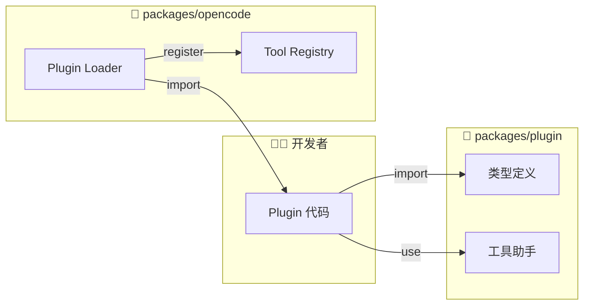

# 包分析: `plugin`

> OpenCode 插件系统的接口定义和开发 SDK。

## 1. 概览 (Overview)
- **路径**: `packages/plugin`
- **定位**: 定义 OpenCode 插件的标准接口，提供开发工具。
- **依赖**: `@opencode-ai/sdk`, `zod`
- **导出**:
    - `.`: 插件生命周期定义
    - `./tool`: 工具定义助手

## 2. 核心架构

`packages/plugin` 是一个 **契约库 (Contract Library)**，它定义了 Plugin 的标准接口，但本身不包含加载或执行逻辑（加载逻辑在 `packages/opencode` 中）。



## 3. 插件定义

### 3.1 基本结构

一个合法的 OpenCode 插件就是一个异步函数：

```typescript
// 插件类型定义
export type Plugin = (input: PluginInput) => Promise<Hooks>

// 插件输入上下文
export type PluginInput = {
  client: OpencodeClient      // SDK Client，与 Server 通信
  project: Project            // 当前项目信息
  $: BunShell                 // Shell 工具 (基于 Bun)
  worktree: string            // 沙箱工作目录
  directory: string           // 项目根目录
}
```

### 3.2 最小示例

```typescript
// my-plugin.ts
export default async function plugin({ client, $ }) {
  return {
    tool: {
      "hello": {
        description: "Say hello",
        parameters: z.object({ name: z.string() }),
        async execute({ name }) {
          return `Hello, ${name}!`
        }
      }
    }
  }
}
```

## 4. 钩子系统 (Hooks)

插件通过返回 `Hooks` 对象介入 Agent 的生命周期：

### 4.1 能力扩展类

| 钩子 | 作用 | 示例场景 |
| :--- | :--- | :--- |
| `tool` | 注册自定义工具 | 数据库查询、API 调用 |
| `auth` | 注册认证流程 | OAuth、API Key 验证 |

### 4.2 消息流控制类

| 钩子 | 作用 | 示例场景 |
| :--- | :--- | :--- |
| `chat.message` | 监听/拦截消息 | 日志记录、敏感词过滤 |
| `chat.params` | 动态修改 LLM 参数 | 根据上下文调整 temperature |

### 4.3 权限控制类

| 钩子 | 作用 | 示例场景 |
| :--- | :--- | :--- |
| `permission.ask` | 自定义权限处理 | 自动批准特定目录 |

### 4.4 AOP 拦截类

| 钩子 | 作用 | 示例场景 |
| :--- | :--- | :--- |
| `tool.execute.before` | 工具执行前拦截 | 参数校验、审计日志 |
| `tool.execute.after` | 工具执行后拦截 | 结果转换、通知 |

### 4.5 实验性功能

| 钩子 | 作用 |
| :--- | :--- |
| `experimental.compaction` | 会话压缩控制 |
| `experimental.completion` | 文本自动补全 |

## 5. 工具定义助手

为了简化工具定义，包导出了 `tool` 辅助函数：

```typescript
import { tool } from "@opencode-ai/plugin/tool"
import { z } from "zod"

// 简化的工具定义
const listFiles = tool({
  description: "列出目录下的文件",
  parameters: z.object({
    path: z.string().describe("目录路径"),
    pattern: z.string().optional().describe("过滤模式"),
  }),
  async execute({ path, pattern }, context) {
    const { $ } = context
    const result = await $`ls ${path} ${pattern || ""}`
    return result.stdout
  }
})

// 导出插件
export default async function plugin(input) {
  return {
    tool: {
      "list-files": listFiles,
    }
  }
}
```

## 6. 完整插件示例

```typescript
// database-plugin.ts
import { tool } from "@opencode-ai/plugin/tool"
import { z } from "zod"

export default async function plugin({ client, project }) {
  // 可以在这里初始化资源
  const db = await initDatabase()
  
  return {
    // 工具定义
    tool: {
      "db-query": tool({
        description: "执行 SQL 查询",
        parameters: z.object({
          sql: z.string(),
        }),
        async execute({ sql }) {
          const result = await db.query(sql)
          return JSON.stringify(result, null, 2)
        }
      }),
    },
    
    // 消息监听
    chat: {
      message: async (message) => {
        console.log(`[DB Plugin] Message: ${message.content}`)
      }
    },
    
    // 权限处理
    permission: {
      ask: async (info, { status }) => {
        // 自动批准数据库相关操作
        if (info.type === "db-query") {
          return { status: "allow" }
        }
        return { status }
      }
    }
  }
}
```

## 7. 插件配置

在 `opencode.json` 中启用插件：

```json
{
  "plugin": [
    "./plugins/database-plugin.ts",
    "./plugins/my-other-plugin.js"
  ]
}
```

或放在 `.opencode/plugin/` 目录下，会被自动扫描加载。

## 8. 总结

`packages/plugin` 定义了开放生态的边界：

- **权限赋能**: 通过 `PluginInput` 安全暴露核心能力
- **全面介入**: `Hooks` 覆盖消息处理、工具执行、LLM 控制全流程
- **类型安全**: 完整的 TypeScript 类型定义
- **简化开发**: `tool` 助手函数降低入门门槛
