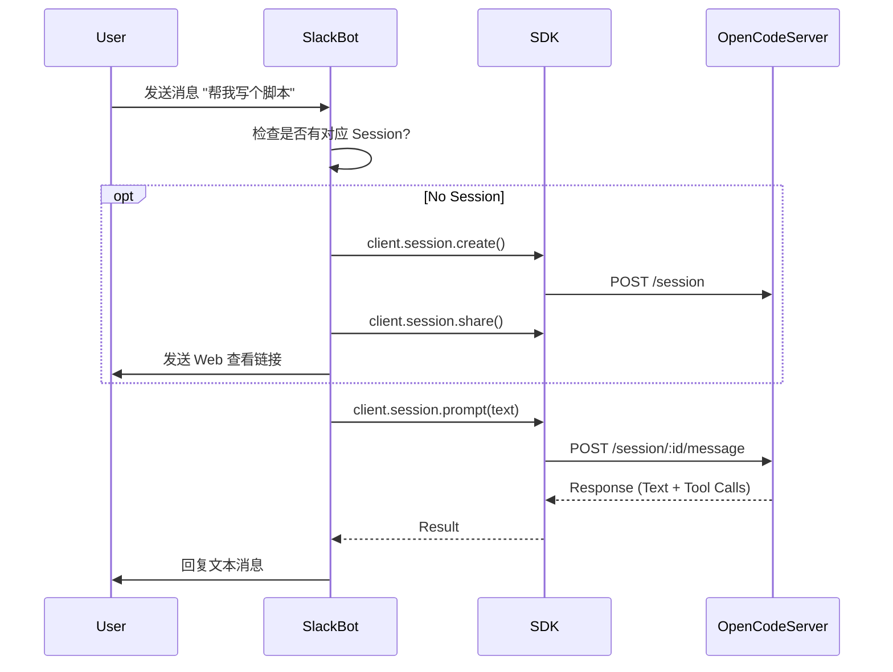

# 包分析: `slack`

> [!NOTE]
> OpenCode 的官方 Slack 机器人集成。

## 1. 概览 (Overview)
- **路径**: `packages/slack`
- **定位**: 将 Slack 转化为 OpenCode 的交互界面，支持群聊协作。
- **技术栈**: `@slack/bolt`, `@opencode-ai/sdk`

## 2. 核心逻辑 (Core Logic)

该包展示了如何利用 `@opencode-ai/sdk` 构建除了 CLI 和 Web 之外的第三种客户端——**Chat Bot**。

### 2.1 会话映射 (Session Mapping)
机器人通过维护一个内存中的 Map 来实现 Slack 线程与 OpenCode 会话的绑定：
- **Key**: `${channel}-${thread_ts}` (Slack 侧的唯一标识)
- **Value**: `SessionID` (OpenCode 侧的唯一标识)

这意味着同一个 Slack 线程内的所有对话都会被发送到同一个 Agent 上下文中，保持了对话的连续性。

### 2.2 消息流 (Message Flow)

### 2.3 工具状态同步 (Tool Sync)
除了简单的问答，机器人还利用 SDK 的 **SSE (Server-Sent Events)** 能力实时推送工具执行状态。

- **监听**: `opencode.client.event.subscribe()`
- **过滤**: `event.type === "message.part.updated"` && `part.type === "tool"`
- **动作**: 当工具执行完成 (`status === "completed"`)，机器人会在 Slack 线程中发送一条通知（例如：`*BashTool* - List files`），让用户知道 Agent 正在干活。

## 3. 关键特性
- **开箱即用**: 只需配置 `SLACK_BOT_TOKEN` 和 `SLACK_APP_TOKEN`。
- **混合协作**: 在 Slack 中对话，点击分享链接即可跳转到 Web 界面查看复杂的代码差异 (Diff) 或终端输出，实现了 "Chat Interface" + "Rich UI" 的无缝切换。
