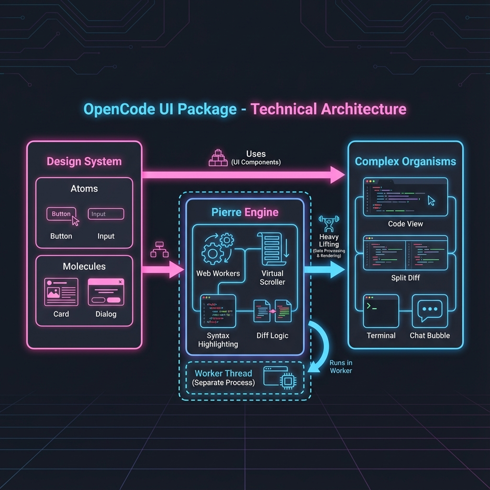

# 包分析: `ui`

## 1. 概览 (Overview)
- **路径**: `packages/ui`
- **定位**: OpenCode 的通用 UI 组件库 (Design System)。
- **技术栈**: SolidJS + TailwindCSS + Kobalte (Headless UI)。
- **关键依赖**:
    - `shiki`: 代码高亮。
    - `marked`: Markdown 渲染。
    - `katex`: 数学公式渲染。
    - `@opencode-ai/sdk`: 复用类型定义。

## 2. 核心架构 (Core Architecture)

`packages/ui` 不仅仅是一个简单的组件库，它内置了高性能的代码渲染引擎。

### 2.1 Pierre 引擎
**Pierre** 是 OpenCode 的核心渲染引擎，封装在 `src/pierre` 目录下。它的核心职责是：
- **Web Worker 驱动**: 所有的 Diff 计算、语法高亮渲染都运行在 Web Worker 中，避免阻塞主 UI 线程。
- **虚拟化渲染**: 利用 `@pierre/diffs` 实现海量代码行的高性能滚动和渲染。
- **自定义主题**: 通过 `styleVariables` 和 CSS 变量 (`--diffs-bg`, `--diffs-addition-base`) 实现了深色/浅色模式的无缝切换。

### 2.2 组件分层
组件库 (`src/components`) 可以分为三个层级：

1.  **Atoms (原子组件)**:
    - 通用 UI 元素：`Button`, `Input`, `Avatar`, `Badge`, `Toast`。
    - 基于 Kobalte 封装，保证了无障碍访问性 (A11y)。

2.  **Molecules (分子组件)**:
    - 业务通用组件：`FileIcon`, `Markdown` (基于 `marked`), `Terminal` (注: 实际 Terminal 逻辑可能在 App 层，但 UI 样式在此定义)。

3.  **Organisms (复杂组件)**:
    - **`Code`**: 高性能代码查看器，支持行选择 (`SelectedLineRange`)。
    - **`Diff`**: 差异对比器，支持 Unified/Split 视图。
    - **`SessionTurn`**: 对话流中的一次交互渲染。
    - **`MessagePart`**: 消息体渲染，支持混合文本、代码块和工具调用结果。

## 3. 核心代码解析

### 3.1 Code 组件 (`src/components/code.tsx`)
这是一个对 `@pierre/diffs` 的 `File` 类的 SolidJS 封装。
- **初始化**: `new File(...)` 在 Worker 中初始化代码模型。
- **渲染**: `file().render(...)` 将渲染结果挂载到 DOM。
- **生命周期**: `createEffect` 监听 props 变化，自动清理旧实例。
- **交互**: 实现了 `handleMouseUp` 来支持跨行文本选择。

### 3.2 Diff 组件 (`src/components/diff.tsx`)
- 封装了 `@pierre/diffs` 的 `FileDiff` 类。
- 支持 `unified` (单栏) 和 `split` (双栏) 两种模式。
- 通过 `cacheKey` (checksum) 优化渲染性能。

## 4. 技术亮点
- **Headless UI**: 使用 Kobalte 提供交互逻辑，Tailwind 提供样式，实现了逻辑与样式的完美分离。
- **Shadow DOM**: 部分复杂组件可能使用了 Shadow DOM 隔离样式 (在 `Code` 组件中看到了 `shadowRoot` 的查询)。
- **Tailwind Native**: 深度集成 tailwind，通过 `src/styles/tailwind` 定义了丰富的设计原子 (Tokens)。
