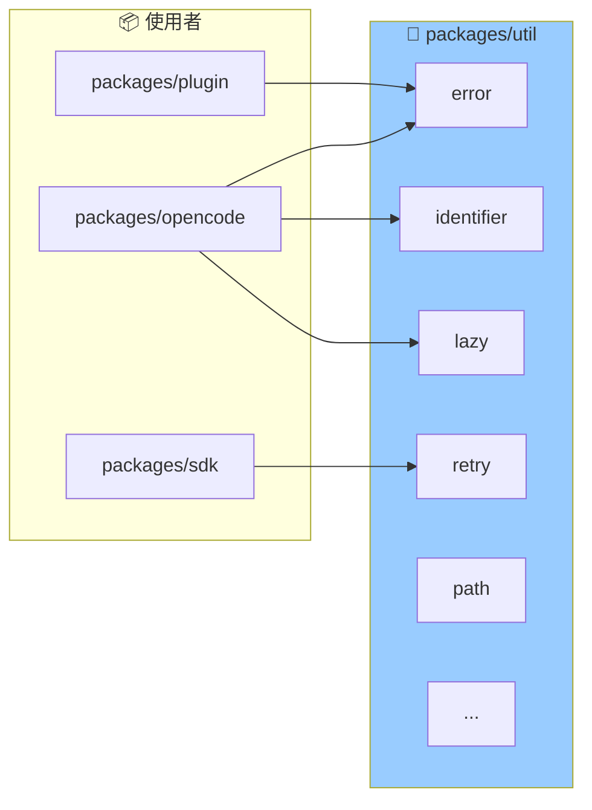

# 包分析: `util`

> OpenCode 的通用工具函数库。

## 1. 概览 (Overview)
- **路径**: `packages/util`
- **定位**: 提供跨包共享的底层工具函数。
- **导出**: 按功能模块独立导出，支持 Tree Shaking。

## 2. 模块架构



## 3. 模块列表

| 模块 | 文件 | 描述 |
| :--- | :--- | :--- |
| **binary** | `binary.ts` | 二进制数据处理 |
| **encode** | `encode.ts` | 编码/解码工具 |
| **error** | `error.ts` | 错误处理和自定义错误类型 |
| **fn** | `fn.ts` | 函数工具 |
| **identifier** | `identifier.ts` | ID 生成器 |
| **iife** | `iife.ts` | 立即执行函数封装 |
| **lazy** | `lazy.ts` | 懒加载工具 |
| **path** | `path.ts` | 路径处理工具 |
| **retry** | `retry.ts` | 重试逻辑 |

## 3. 核心模块解析

### 3.1 Error (`error.ts`)

定义了类型安全的错误工厂：

```typescript
import { NamedError } from "@opencode-ai/util/error"

// 定义错误类型
const InvalidSkillError = NamedError.create(
  "SkillInvalidError",
  z.object({
    path: z.string(),
    message: z.string().optional(),
    issues: z.custom<z.core.$ZodIssue[]>().optional(),
  })
)

// 使用
throw new InvalidSkillError({
  path: "/path/to/skill",
  message: "Missing description field"
})
```

**优势**:
- 类型安全的错误参数
- 统一的错误命名规范
- 便于错误序列化和调试

### 3.2 Identifier (`identifier.ts`)

生成唯一标识符：

```typescript
import { Identifier } from "@opencode-ai/util/identifier"

// 生成带前缀的 ID
const sessionID = Identifier.create("session")  // "session_abc123..."
const messageID = Identifier.ascending("message")  // 时间顺序排序的 ID
```

### 3.3 Lazy (`lazy.ts`)

懒加载包装器，用于延迟初始化重量级模块：

```typescript
import { lazy } from "@opencode-ai/util/lazy"

const pty = lazy(async () => {
  const { spawn } = await import("bun-pty")
  return spawn
})

// 首次调用时加载
const spawn = await pty()
```

### 3.4 Retry (`retry.ts`)

带指数退避的重试逻辑：

```typescript
import { retry } from "@opencode-ai/util/retry"

const result = await retry(
  async () => {
    const res = await fetch(url)
    if (!res.ok) throw new Error("Failed")
    return res.json()
  },
  {
    maxRetries: 3,
    initialDelay: 100,
    backoff: 2,  // 指数退避因子
  }
)
```

## 4. 导入方式

包使用 **子路径导出**，每个模块独立导入：

```typescript
// ✅ 正确 - 只导入需要的模块
import { NamedError } from "@opencode-ai/util/error"
import { lazy } from "@opencode-ai/util/lazy"

// ❌ 错误 - 不支持整体导入
import * as util from "@opencode-ai/util"
```

这种设计确保了：
- **Tree Shaking**: 未使用的代码不会打包
- **明确依赖**: 清楚知道使用了哪些工具

## 5. 总结

`packages/util` 遵循了 **最小化原则**：
- 只包含真正通用的工具
- 每个文件独立、聚焦
- 无外部依赖（除了 zod 用于 error 模块）

这是一个典型的 Monorepo 共享库设计。
