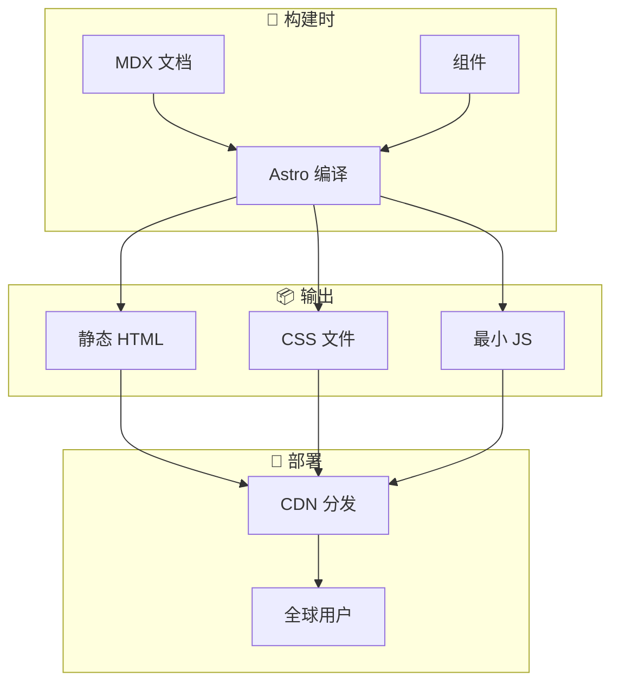

# 包分析: `web`

> OpenCode 的官方文档站点和落地页。

## 1. 概览 (Overview)
- **路径**: `packages/web`
- **定位**: OpenCode 的官方文档站点/落地页，面向公众的产品展示和技术文档。
- **技术栈**: Astro + Starlight
- **部署**: 静态网站 (Vercel/Netlify/Cloudflare Pages)

## 2. 核心架构



### 2.1 技术选型

| 技术 | 作用 |
| :--- | :--- |
| **Astro** | 静态站点生成器 (SSG)，零 JS 优先 |
| **Starlight** | Astro 的文档主题，内置搜索/导航 |
| **MDX** | Markdown + JSX，支持组件嵌入 |
| **TailwindCSS** | 样式框架 |

### 2.2 目录结构

```
packages/web/
├── src/
│   ├── content/
│   │   └── docs/          # Markdown 文档
│   ├── components/        # 自定义组件
│   └── pages/             # 动态页面
├── public/                # 静态资源
├── astro.config.mjs       # Astro 配置
└── package.json
```

## 3. 与 `packages/app` 的对比

| 特性 | `packages/app` | `packages/web` |
| :--- | :--- | :--- |
| **角色** | **产品本体** (The Product) | **产品说明书** (The Docs) |
| **类型** | SPA (Single Page App) | SSG (Static Site Generator) |
| **框架** | SolidJS + Vite | Astro + Starlight |
| **部署** | 也是 Tauri Desktop 的内核 | 部署为静态网站 |
| **内容** | 编辑器、终端、会话窗口 | 指南、API 文档、博客 |
| **用户** | OpenCode 使用者 | 开发者、潜在用户 |

## 4. 为什么分离？

这是一个非常好的工程实践：

1. **性能优化**
   - Web 是纯静态页面，加载极快
   - App 是复杂的交互应用，需要 JS

2. **SEO 友好**
   - Astro 生成的静态 HTML 对搜索引擎友好
   - SPA 的 SEO 天然较弱

3. **维护分离**
   - 产品迭代不影响文档站点
   - 文档更新不需要重新构建产品

## 5. 关键特性

- **文档搜索**: Starlight 内置 Pagefind 全文搜索
- **版本管理**: 支持多版本文档
- **国际化**: 可配置多语言支持
- **暗黑模式**: 自动跟随系统主题

## 6. 本地开发

```bash
cd packages/web
bun install
bun dev        # 启动开发服务器
bun build      # 构建静态站点
```

## 7. 总结

`packages/web` 专注于 **内容呈现**：
- 产品介绍和功能展示
- 开发者文档和 API 参考
- 博客和更新日志

它与 App 形成了清晰的职责分离：**App 做交互，Web 做展示**。
